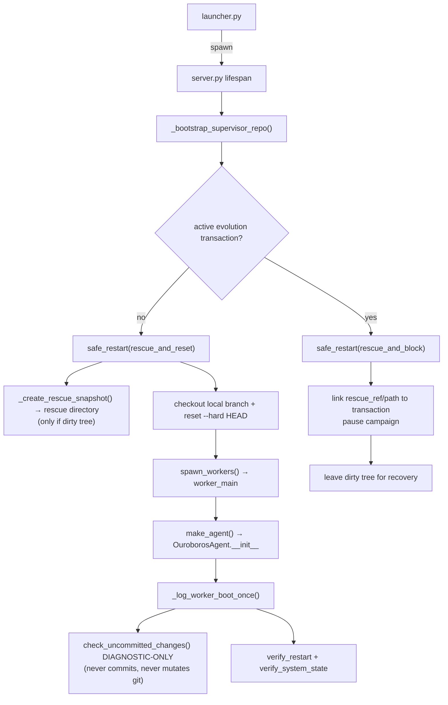

# Ouroboros v6.15.0 — Architecture & Reference

This file is NOT a changelog. Version history lives in README.md, git tags, and commit log.

This document is the current operational map of Ouroboros: structure, data flows, APIs, protected boundaries, and the rationale for non-obvious architectural choices. Rationale must be self-contained here; future maintainers should not need to open old commits to understand why a guard, review gate, or lifecycle exists.

---

## 1. High-Level Architecture

```
User
  │
  ▼
launcher.py (PyWebView)       ← desktop window, immutable outer shell (tracked in git; bundled as packaged entry point)
  │
  │  spawns subprocess
  ▼
server.py (Starlette+uvicorn) ← HTTP + WebSocket on configurable host:port (default localhost:8765; Docker/non-loopback supported via OUROBOROS_SERVER_HOST=0.0.0.0)
  │
  ├── web/                     ← Web UI (SPA with ES modules in web/modules/)
  │
  ├── supervisor/              ← Background thread inside server.py
  │   ├── message_bus.py       ← Queue-based local message bus (Web UI + reviewed transport skills)
  │   ├── workers.py           ← Multiprocessing worker pool (fork/spawn by platform)
  │   ├── state.py             ← Persistent state (state.json) with file locking
  │   ├── queue.py             ← Task queue management (PENDING/RUNNING lists)
  │   ├── events.py            ← Event dispatcher (worker→supervisor events)
  │   └── git_ops.py           ← Git operations (clone, checkout, rescue, rollback, push, credential helper)
  │
  └── ouroboros/               ← Agent core (runs inside worker processes)
      ├── config.py            ← SSOT: paths, settings defaults, load/save, PID lock
      ├── colab_bootstrap.py   ← Google Colab source-mode bootstrap helpers, driven by the `notebooks/colab_quickstart.py` cell script: Drive-backed data/settings, fork-safe env, personal origin provisioning, no-UI server command assembly, and loopback install/enable/full_access of the Telegram bridge
      ├── cli.py               ← Source/headless CLI over gateway tasks, logs, settings, skills, marketplace, local-model, and MCP wrappers
      ├── packaged_cli.py      ← Packaged desktop CLI bridge: resolves bundle roots, bootstraps the launcher-managed repo, and delegates to cli.py
      ├── packaged_cli_install.py ← Packaged CLI installer planning/execution for user-local command shims
      ├── agent.py             ← Task orchestrator
      ├── agent_startup_checks.py ← Startup verification and health checks
      ├── agent_task_pipeline.py  ← Task execution pipeline orchestration
      ├── extension_companion.py ← Host-supervised companion processes for transport skills
      ├── event_bus.py         ← Typed in-process event bus for skill subscriptions
      ├── evolution_checkpoints.py ← Append-only campaign/eval checkpoint ledger for evolution progress
      ├── improvement_backlog.py ← Minimal durable advisory backlog helpers + digest formatting
      ├── loop.py              ← High-level LLM tool loop
      ├── loop_llm_call.py     ← Single-round LLM call + usage accounting
      ├── loop_tool_execution.py ← Tool dispatch and tool-result handling
      ├── observability.py     ← Private forensic execution ledger: redaction, gzip CAS blobs, call manifests, trace refs
      ├── outcomes.py          ← Typed loop/task outcome, artifact bundle, verification ledger helpers
      ├── code_intelligence.py ← Internal code inventory v1: file facts, hashes, Python symbols/imports, JS/TS heuristics
      ├── pricing.py           ← Model pricing, cost estimation, usage events
      ├── llm.py               ← Multi-provider LLM routing (OpenRouter/OpenAI/compatible/Cloud.ru/GigaChat/Anthropic) with adaptive request-parameter normalization for provider capabilities/rejections
      ├── mcp_client.py        ← HTTP/SSE MCP client manager: parses MCP_SERVERS, validates URLs/auth headers, masks tokens, normalizes external tool names as mcp_<server>__<tool>, refreshes tool lists, and dispatches calls through the guarded Python mcp SDK import
      ├── safety.py            ← Policy-based LLM safety check
      ├── consciousness.py     ← Background thinking loop (with progress emission)
      ├── consolidator.py      ← Block-wise dialogue consolidation (dialogue_blocks.json)
      ├── memory.py            ← Scratchpad, identity, chat history
      ├── context.py           ← LLM context builder (public API for consciousness)
      ├── context_budget.py    ← Context-window budget SSOT for low/max profiles, raw-tail sizing, compaction thresholds, and static section limits
      ├── context_layout.py    ← Reference-doc layout SSOT: max/low doc tiers, ARCHITECTURE navigation map, DEVELOPMENT full/pointer policy, README/CHECKLISTS on-demand pointers
      ├── context_compaction.py ← Context trimming and summarization helpers
      ├── headless.py          ← Headless task child-drive isolation, workspace patch artifacts, and memory export helpers
      ├── artifacts.py         ← Task-scoped artifact helpers shared by user-file tools, process outputs, and outcome finalization
      ├── workspace_preflight.py ← Read-only external-workspace git/manifest/toolchain snapshot used by gateway task creation
      ├── local_model.py       ← Local LLM lifecycle (llama-cpp-python)
      ├── local_model_autostart.py ← Local model startup helper
      ├── deep_self_review.py   ← Deep self-review: Generated Scope Atlas repository context + full memory whitelist → 1M-context model
      ├── review.py            ← Code collection, complexity metrics, pre-commit review
      ├── preflight_runner.py  ← Hermetic reviewed-change pytest runner: disposable git worktree, candidate diff replay, temp data/settings/pycache env, and launcher-env scrub so review tests cannot mutate live repo/data
      ├── review_substrate.py  ← Shared reviewer-slot coordinator for task acceptance and the migration target for remaining review surfaces; duplicate model ids are independent slots
      ├── review_state.py      ← Durable advisory pre-review state (advisory_review.json)
      ├── triad_review.py      ← Shared multi-model review primitives: JSON-array extraction is reused by repo + skill review; per-actor records, quorum/degraded accounting, and model-error events power the skill-review path
      ├── onboarding_wizard.py ← Shared desktop/web onboarding bootstrap + validation
      ├── settings_setup_contract.py ← SSOT for Settings/Onboarding setup contract, derived bootstrap state, and setup payload validation
      ├── owner_inject.py      ← Per-task user message mailbox (compat module name)
      ├── launcher_bootstrap.py ← Bundle-to-repo bootstrap and managed sync helpers (used by launcher.py)
      ├── provider_models.py   ← Provider-specific model ID helpers, direct-provider defaults (OpenAI, Anthropic, Cloud.ru, GigaChat)
      ├── runtime_mode_policy.py ← Runtime-mode protected-path policy (safety-critical files, frozen contracts, release/managed invariants) shared by registry, git tools, and Claude gateway guards
      ├── schedule_contract.py ← Schedule id, 5-field cron, and IANA timezone validation SSOT shared by gateway, manifests, and supervisor queue
      ├── reflection.py        ← Execution reflection and pattern capture
      ├── repo_remotes.py      ← Role-based GitHub remote provisioning: official update source (`managed`) stays read/update-only, personal persistence target (`origin`) can be auto-forked/configured from GitHub token
      ├── review_evidence.py   ← Structured review findings/obligations snapshot for summaries and reflections
      ├── skill_loader.py      ← Skill discovery + durable skill state (v5.8.2: walks data/skills/{native,clawhub,ouroboroshub,external}/ + optional OUROBOROS_SKILLS_REPO_PATH; persists to data/state/skills/<name>/; tags each LoadedSkill with `source` and `.self_authored.json` provenance; v5.19 computes review verdicts live from stored findings)
      ├── skill_readiness.py   ← Central skill readiness helper: combines review gate, stale hash, enablement, and grants into a single finalization/execution verdict
      ├── skill_dependencies.py ← Shared dependency-spec resolution for skill payloads across manifests, sidecars, and provenance
      ├── skill_review_status.py ← Skill-review verdict aggregation SSOT (FAILs → clean/warnings/blockers/pending; hard trust-boundary items block on FAIL, bug_hunting + selected conditional safety items follow severity; enforcement maps verdicts to executable_review)
      ├── skill_review.py      ← Skill review pipeline: deterministic preflight + optional fail-open Claude Code advisory over the skill payload only (repo diff excluded, Skill Review Checklist coverage contract, scope-review effort, raw/session metadata plus parsed_items/contract_warning persisted as advisory_result) followed by the tri-model executable trust gate against the Skill Review Checklist section of docs/CHECKLISTS.md plus minimal host skill/widget context (CREATING_SKILLS.md, PluginAPI contract, extension UI validator); supports rebuttal/history/convergence evidence
      ├── extension_loader.py  ← Phase 4 loader for type: extension skills; imports no-dependency pure-Python extensions in-process with PluginAPIImpl, but catalogs isolated-dep/native-marker extensions through child-process proxies so plugin import cannot abort server.py; tracks registrations per-skill for atomic unload
      ├── extension_process_runner.py ← Short-lived child-process runner for isolated-dep/native-marker extension catalog/tool/route/WS dispatch; uses scrubbed env, per-skill deps, process-group tracking, timeout/output caps, and returns graceful host errors on child crash
      ├── extension_ui_validation.py ← Host-owned widget/settings render-schema validation shared by extension loader and skill preflight
      ├── extension_isolated_deps.py ← Per-extension bridge for legacy/forced in-process isolated-dep tests; production reviewed isolated deps are exposed only inside extension_process_runner children
      ├── extension_health.py  ← Durable per-extension health vector (data/state/skills/<name>/health.json): live->broken regression memory across restarts, surfaced via health invariants + startup check + Installed UI
      ├── skill_token.py       ← Opaque Host Service API token wrapper used by reviewed skills/companions
      ├── marketplace/         ← ClawHub + OuroborosHub marketplace package (clawhub.py registry client, ouroboroshub.py static GitHub catalog client, fetcher.py staging, adapter.py OpenClaw->Ouroboros translation, install.py orchestration, isolated_deps.py per-skill dependency prefix, provenance.py durable provenance)
      ├── skill_lifecycle_queue.py ← single FIFO lane for mutating skill lifecycle actions (install/update/review/deps/enable/disable/uninstall) with recent event snapshot for Skills UI, chat live-card progress, dedupe keys, and sync tool wrapper
      ├── skill_review_runner.py ← shared lifecycle-backed skill review runner for API + agent tool paths; writes review_job.json + skill_review_* events and routes all executable skills (including self-authored provenance) through tri-model review
      ├── server_auth.py       ← Non-localhost auth gate (OUROBOROS_NETWORK_PASSWORD)
      ├── server_control.py    ← Process-control helpers: restart, panic stop
      ├── server_entrypoint.py ← CLI argument parsing, port-binding helpers
      ├── server_runtime.py    ← Server startup/onboarding and WebSocket liveness helpers
      ├── server_web.py        ← Static web file helpers (NoCacheStaticFiles, web dir resolver)
      ├── task_continuation.py ← Durable per-task review continuation state across restart/outage
      ├── task_results.py      ← Durable task result/status files (task_results/<id>.json)
      ├── task_status.py       ← Effective task-status SSOT: child-drive result merge, lineage lookup, bounded waits
      ├── tool_capabilities.py ← SSOT for tool sets (core, parallel-safe, truncation, browser)
      ├── tool_access.py       ← Tool API v2 policy matrix: ToolProfile × ResourceRoot × Operation
      ├── tool_policy.py       ← Tool access policy and gating (imports from tool_capabilities)
      ├── utils.py             ← Shared utilities; v5.8.3-rc.2 SSOT for JSON atomic writes/reads, UTC timestamps, hashes, log sanitization, and subprocess helpers
      ├── world_profiler.py    ← System profile generator (WORLD.md)
      ├── contracts/           ← Frozen ABI (Phase 1 Protocols + TypedDicts + SkillManifest; Phase 4 adds plugin_api.py with PluginAPI + ExtensionRegistrationError + permission/route-method/forbidden-settings tuples)
      │   ├── tool_context.py  ← ToolContextProtocol (minimum tool ABI, duck-typed)
      │   ├── tool_abi.py      ← ToolEntryProtocol + GetToolsProtocol
      │   ├── api_v1.py        ← WS/HTTP envelope TypedDicts
      │   ├── chat_id_policy.py ← SSOT for human-visible vs synthetic transport chat ids
      │   ├── task_constraint.py ← Structured per-task execution constraints for skill repair payload confinement
      │   ├── skill_payload_policy.py ← Shared skill-payload path resolution policy for data/skills buckets, path confinement, and control-plane sidecar detection
      │   ├── skill_manifest.py ← Unified SKILL.md / skill.json parser (instruction|script|extension)
      │   ├── schema_versions.py ← Opt-in _schema_version helpers
      │   └── plugin_api.py    ← Phase 4: PluginAPI Protocol + ExtensionRegistrationError + FORBIDDEN_EXTENSION_SETTINGS + VALID_EXTENSION_PERMISSIONS + VALID_EXTENSION_ROUTE_METHODS
      ├── gateways/            ← External API adapters (thin transport, no business logic)
      │   └── claude_code.py   ← Claude Agent SDK gateway (edit path via ClaudeSDKClient lifecycle; read-only advisory path isolated in a Python child process with structured signal/timeout errors and normalized SDK usage)
      ├── gateway/             ← Gateway Boundary v1: all browser-facing HTTP/WS route ownership and frontend contract SSOT
      │   ├── contracts.py     ← PRO-frozen HTTP/WS envelope and endpoint index (canonical replacement for the legacy contracts/api_v1.py surface)
      │   ├── router.py        ← Starlette route collector for /api/* and /ws
      │   ├── ws.py            ← WebSocket connection manager, extension WS dispatch, browser broadcast helpers
      │   ├── state.py         ← /api/health and /api/state handlers
      │   ├── tasks.py         ← Headless task create/list/get/cancel/events endpoints over the supervisor queue
      │   ├── logs.py          ← Read-only runtime log tail endpoint for CLI/headless clients
      │   ├── settings.py      ← /api/settings, /api/owner/*, onboarding, Claude runtime status/repair handlers
      │   ├── control.py       ← reset, command, git/update, and evolution-data handlers
      │   ├── schedules.py     ← queue-backed cron schedule HTTP surface (list/upsert/delete)
      │   ├── files.py         ← File Browser + chat upload endpoints
      │   ├── models.py        ← model catalog + local-model lifecycle endpoints
      │   ├── extensions.py    ← extensions/skills HTTP surface (GET /api/extensions, GET /api/extensions/<skill>/manifest, ALL /api/extensions/<skill>/<rest:path>, POST /api/skills/<skill>/toggle, POST /api/skills/<skill>/delete, POST /api/skills/<skill>/review, POST /api/skills/<skill>/grants)
      │   ├── marketplace.py   ← ClawHub + OuroborosHub HTTP surface
      │   ├── mcp.py           ← MCP Settings API surface backed by the shared MCPManager
      │   ├── host_service.py  ← Loopback-only Host Service API for reviewed skill callbacks
      │   ├── history.py       ← Chat history + cost breakdown endpoint factories
      │   └── _helpers.py      ← shared HTTP request root helpers, coercion, and JSON error envelope
      ├── tools/               ← Auto-discovered tool plugins
      │   ├── extension_dispatch.py ← Extension tool dispatch helper extracted from registry.py; preserves liveness, safety, async, and out-of-process error contracts
      │   ├── shell_parse.py     ← Shared shell argv/cwd helpers for registry safety checks and run_command validation
      │   ├── release_sync.py    ← Release-metadata sync library; advisory_review uses sync_release_metadata before provider spend when VERSION is in scope; _preflight_check uses check_history_limit for P9 row caps; agents can also call it directly for version-carrier sync
      │   ├── review_synthesis.py ← LLM-based claim synthesis (Phase 1): deduplicates raw multi-reviewer findings into canonical issues before durable obligations are created; called from commit_gate._record_commit_attempt; fail-open (returns original on any error)
      │   ├── ci.py              ← CI trigger and monitoring (GitHub Actions API)
      │   ├── claude_advisory_review.py ← Advisory pre-review tool (read-only Claude Agent SDK)
      │   ├── recent_tasks.py    ← Read-only context recovery tool exposing recent task_results summaries/traces for LLM-first continuation recovery
      │   ├── commit_gate.py     ← Advisory freshness gate and commit-attempt recording (extracted from git.py); `_record_commit_attempt` runs LLM-based claim synthesis (via `review_synthesis.py`) on blocked attempts before durable obligations are created
      │   ├── git_rollback.py    ← vcs_rollback tool (wraps git_ops.rollback_to_version)
      │   ├── git_pr.py          ← PR integration tools: fetch_pr_ref, create_integration_branch, cherry_pick_pr_commits, stage_adaptations, stage_pr_merge (non-core, require enable_tools)
      │   ├── github.py          ← GitHub integration: issues (list/get/comment/close) + PR tools: list_github_prs, get_github_pr, comment_on_pr (non-core; github.py is in _FROZEN_TOOL_MODULES so PR inspection/comment tools work in packaged builds)
      │   ├── parallel_review.py ← Parallel triad+scope orchestration and verdict aggregation (extracted from git.py)
      │   ├── plan_review.py     ← Pre-implementation design review (adaptive context levels, shared ReviewCoordinator slots, duplicate model IDs allowed, plan_task tool)
      │   ├── review.py          ← Task acceptance review tool plus multi-review adapters backed by the shared review substrate
      │   ├── review_context_atlas.py ← Deterministic bounded-context compiler for scope_review, plan_task, and deep_self_review; raw-inlines selected files and accounts for every tracked path in the manifest
      │   ├── review_helpers.py  ← Shared review helpers (section loader, touched/head packs, intent, pytest preflight via agent interpreter)
      │   ├── review_revalidation.py ← Reviewed-commit fingerprint revalidation helpers (blocks when staged diff changes after review)
      │   ├── scope_review.py   ← Scope reviewer (enforcement-aware, budget-aware)
      │   ├── services.py        ← Task-scoped long-running service mini-manager: start/status/logs/stop with process-group cleanup and retained private log blobs
      │   ├── skill_exec.py      ← Phase 3 external-skill surface: list_skills, skill_review, toggle_skill, skill_exec (subprocess runner with cwd confinement, env scrubbing, timeout, runtime allowlist python/python3/bash/node/deno/ruby/go; gated by enabled + fresh executable review + fresh content hash — v5.1.2 Frame A: runtime_mode no longer blocks execution)
      │   ├── skill_publish.py   ← Agent-callable `submit_skill_to_hub` tool: validates a fresh clean-reviewed local skill (sources `external`/`self_authored`/`user_repo`/`ouroboroshub`/`clawhub`; `native` only when no `.seed-origin` marker), infers OuroborosHub from `OUROBOROS_HUB_CATALOG_URL`, commits payload + catalog update to the user's fork via GitHub GraphQL, and opens a PR without mutating the local Ouroboros repo. For marketplace-managed sources the generated PR body is force-prefixed with a `## Provenance` block read from the local sidecar (`.ouroboroshub.json` slug / `.clawhub.json` clawhub_slug); when no sidecar exists the source is reclassified as `external` by skill_loader and submit proceeds without the block.
      │   └── skill_preflight.py ← v5.7.0 heal-safe, read-only skill payload preflight validator (manifest parse + Python compile() / node --check / bash -n; no review-state mutation)
      └── platform_layer.py    ← Cross-platform process/path/locking helpers

# Build & CI (not part of runtime)
.github/workflows/ci.yml     ← Four-tier CI (quick / full / integration / build+release)
build.sh                      ← macOS build (PyInstaller → .dmg)
build_linux.sh                ← Linux build (PyInstaller → .tar.gz)
build_windows.ps1             ← Windows build (PyInstaller → .zip)
scripts/build_repo_bundle.py  ← Builds `repo.bundle` + `repo_bundle_manifest.json` for packaged releases
scripts/run_external_review.py ← v5.1.2 dev-loop tool: invokes `ouroboros.tools.parallel_review.run_parallel_review` from outside the runtime against `git diff --cached`. Reads `~/Ouroboros/data/settings.json` for `OPENROUTER_API_KEY` / `OUROBOROS_REVIEW_MODELS` / `OUROBOROS_SCOPE_REVIEW_MODELS`, builds a minimal `ToolContext`, prints FULL raw triad+scope output (no truncation). Used to dry-run the same review pipeline `commit_reviewed` triggers before any actual commit. Output: stdout (and optional `--output PATH`). Not part of the runtime gate; review-exempt dev tool.
scripts/cleanup_test_pollution.py ← Dry-run-first cleanup utility for local test-pollution artifacts: known test skill state dirs, stale `__extension_imports`, and accidental `MagicMock`-named repo-root files. Use `--apply` only after inspecting planned removals.
scripts/swebench_cli_agent.py ← Helper that turns local checkout-backed SWE-bench rows into prediction JSONL via the CLI/headless task API.
scripts/terminal_bench_cli_agent.py ← Minimal Terminal-Bench BaseAgent bridge that delegates task solving through `ouroboros run` when the task workspace is mounted on the gateway host.
packaging/cli/                ← Packaged CLI shell/cmd wrappers and user-local installer launchers copied into desktop artifacts
Dockerfile                    ← Docker image (web UI runtime)
```

### Gateway Boundary v1

`ouroboros/gateway/` is the single browser-facing boundary between the
vanilla-JS frontend and the Python runtime. `server.py` owns process startup,
lifespan, supervisor hosting, and static-file mounting; `gateway/router.py`
owns every `/api/*` route and `/ws`; domain modules under `gateway/` own the
actual HTTP handlers. This keeps frontend work pointed at one explicit contract
surface instead of requiring contributors to understand supervisor, worker,
marketplace, extension, MCP, local-model, and settings internals at once.

The frozen contract is `ouroboros/gateway/contracts.py`. It carries the HTTP
endpoint index, WebSocket message discriminators, and TypedDict envelope shapes.
`runtime_mode='advanced'` may refactor gateway handlers and router plumbing, but
editing `gateway/contracts.py` is protected as a frozen contract and requires
`runtime_mode='pro'` plus the normal triad + scope review gate. The legacy
`ouroboros/contracts/api_v1.py` module remains as a compatibility import only.

Frontend modules call backend routes through `web/modules/api_client.js`, with
JSDoc mirrors in `web/modules/api_types.js`. `web/package.json` defines the UI
subpackage boundary without adding npm dependencies, TypeScript, codegen, or a
build step. `tests/test_gateway_parity.py` checks that the contract endpoint
index stays aligned with `gateway/router.py` and that the JSDoc mirror stays
present for the core browser-facing envelopes.

### CLI / Headless Boundary

`ouroboros.cli` is the second first-class interface to the same runtime. It is a
thin HTTP/SSE client over the gateway, not a benchmark-only harness and not a
parallel scheduler. `POST /api/tasks` creates managed queue tasks, `GET
/api/tasks/<id>` reads durable results, `GET /api/tasks/<id>/events`
replays task-scoped events from the existing logs before following live SSE
updates, and `GET /api/tasks/<id>/artifacts/<name>` serves declared task
artifacts from the task artifact directory only. For task streaming commands
such as `run` and `tasks watch`, stdout is
reserved for final machine-consumable output (or JSONL when requested) while
progress goes to stderr; status and admin wrappers may print human summaries.
`ouroboros schedule list|add|remove` is the CLI wrapper over `/api/schedules`;
it manages persisted 5-field cron schedules that enqueue ordinary tasks through
the supervisor queue rather than running a separate scheduler daemon.

Skill-manifest `scheduled_tasks` are mirrored into the same table by
`supervisor/queue.py::sync_skill_schedules`, whose enable gate is the
`skill_readiness_for_execution()` SSOT (review/grants/deps/enablement) plus a
`supervised_task` permission check. `resync_skill_schedules()` runs on every
skill lifecycle change (toggle, grants, reconcile, delete, review, and
marketplace install→review/uninstall) and on a 60 s scheduler tick; schedules
whose source skill or `scheduled_task` no longer exists are removed, not left as
disabled tombstones. A blank schedule timezone resolves the DST-aware system
local zone (`TZ`/`/etc/localtime`), falling back to a fixed current offset only
when no IANA name is found — set an explicit IANA timezone for DST-critical
schedules. A compact active-schedule digest (capped, with an omission note) is
injected into both normal task context and background consciousness context.

Packaged desktop artifacts ship a tiny `bin/ouroboros` wrapper and installer
instead of a second PyInstaller runtime. The wrapper runs the bundled
`python-standalone`, bootstraps the launcher-managed repo from the embedded
`repo.bundle` when needed, and then delegates to this same `ouroboros.cli`
module. In packaged mode, `run --start` launches the desktop app/launcher and
waits for `/api/health` plus `api_state.supervisor_ready`; it must not start
`server.py` directly through `sys.executable -m`, because that bypasses the
launcher-owned bootstrap, process record, and managed repo lifecycle.

Packaged artifacts also bundle an official, notarized **Node.js LTS** runtime
under `node-standalone/` (pruned to just `bin/node[.exe]`). The build scripts
fetch it via `scripts/download_node_standalone.sh`/`.ps1` (SHASUMS-verified)
before PyInstaller, and the macOS signing pass re-signs it under the hardened
runtime so it is not code-signing-killed (SIGKILL) when launched from the
packaged app. `platform_layer.resolve_bundled_node()` prefers this bundled node
over a PATH (e.g. Homebrew) node for `node`-runtime skills and the `node --check`
preflight; in dev builds without the bundle it falls back to PATH node.

External workspace tasks keep `Env.repo_dir` pinned to the Ouroboros repo for
prompts, BIBLE, architecture/development docs, skills, and review policy.
`ToolContext` carries an optional `workspace_root`; contextual repo tools resolve
through `active_repo_dir()` when workspace mode is set. Workspace roots must be
separate git worktree roots and must not overlap the Ouroboros system repo or
data drive. Workspace mode uses an explicit allowlist for contextual repo/data,
search, shell, git status/diff, browser, and log/history tools; self-review,
runtime control, skill lifecycle, extension/MCP execution, commit/review, and
delegation tools are hidden and hard-blocked. The target workspace is left dirty
by design and exported as a patch artifact; Ouroboros does not commit inside
external repositories, and shell execution reports a hard warning if git refs move.
The CLI downloads patch artifacts through the task artifact endpoint, waits for
artifact finalization in `--patch` / `--patch-out` mode, and fails nonzero when
the patch is missing, empty, or failed. `--no-stream` suppresses live progress
but still waits; `--detach` is the explicit create-and-return mode.
Benchmark helper scripts likewise require clean per-instance local checkouts;
they do not reset or commit benchmark workspaces.

Workspace mode is a tool-routing and blast-radius guard, not an OS sandbox.
Like OpenClaw's host workspace mode, absolute host paths are not a hard security
boundary unless a future Docker/SSH/remote sandbox is added around tool
execution. Do not grow ad-hoc shell parsing to approximate that sandbox.
Project-local dependency installs are ordinary workspace work. In
`runtime_mode=pro`, system/global dependency installs may be attempted through
`run_command` and the safety supervisor when needed by the external workspace;
sudo must be noninteractive (`sudo -n`) and password-prompting sudo is blocked.

Headless memory isolation is implemented as a per-task child drive under
`data/state/headless_tasks/<task_id>/data`. `forked` mode copies stable memory
seed files (`identity.md`, `WORLD.md`, `registry.md`, and `knowledge/`) without
dialogue/task history; `empty` mode starts from a fresh child drive; live
`shared` mode is disabled for subagents and external workspace tasks until a
sanitized shared-context v2 exists. Ordinary local root tasks may still use the
parent drive directly when no external workspace isolation is requested. External
runs produce explicit artifacts under `data/task_results/artifacts/<task_id>/`:
`workspace_preflight.json`, `workspace_patch.json`, and `memory_export.json`;
successful patch finalization also produces `workspace.patch`, while failed
patch finalization records `artifact_status=failed` and the manifest only.
`workspace_patch.json` records patch size, sha256, diffstat, included/excluded
untracked paths, git diagnostics, and artifact errors. The parent result carries `artifact_status`
(`pending`/`finalizing`/`ready`/`failed`) so headless clients cannot observe a
terminal workspace result before artifacts are ready or explicitly failed.
Headless runs never auto-merge memory back into the parent drive. Queued
non-workspace tasks may also request `memory_mode=forked|empty`; in that case
the same child-drive mechanism is used for memory isolation while the active repo
remains the Ouroboros repo. Swarm
readiness in v1 is implemented as live child tasks over the existing queue:
`schedule_subagent` emits a normal `schedule_subagent` event, the supervisor enqueues it
as a child task, and an existing worker executes it. There is no separate
scheduler, dashboard, endpoint, or settings surface. Child lineage is inferred
from the active `ToolContext` and persisted as `parent_task_id`, `root_task_id`,
`session_id`, `actor_id`, `delegation_role`, `role`, `memory_mode`,
`drive_root`, `child_drive_root`, `budget_drive_root`, and `task_constraint`.
`task_status.py` is the effective-status SSOT for gateway and tool reads: a
child terminal result overrides a stale parent `requested`/`scheduled`/`running`
result, while authoritative parent terminal failures/cancellations stay
authoritative. Workspace artifact tasks stay nonterminal while
`artifact_status` is `pending`/`finalizing`; only `ready`/`failed` artifact
states make the effective workspace result terminal. `wait_task` performs a
bounded wait (default 180s), and `wait_tasks` performs batch waits (default
600s) with full per-child result, trace, and cost output preserved untruncated.

Workspace tasks expose read-only knowledge access (`knowledge_read` and
`knowledge_list`) because `workspace_task` permits runtime-data reads; mutating
cognitive tools still stay out of the workspace allowlist. Parent memory changes
come from the post-task experience review/import path, not directly from the
workspace child.

Live subagents run with deterministic
`task_constraint.mode="local_readonly_subagent"`. The registry filters their
visible tool schemas to repo/data/history reads plus web/browser inspection and
also blocks forbidden calls at execute time, including local writes, commits,
review mutation, runtime control, tool expansion, skills, MCP/extensions, shell,
and further `schedule_subagent` recursion. Generic `read_file(root=runtime_data)` /
`list_files(root=runtime_data)` behavior is unchanged for normal tasks, but subagents additionally deny known
secret/control files such as `settings.json`, token/credential/key files, and
secret-like owner-state paths. Browser tools remain available for remote-page
inspection, but subagents fail closed instead of auto-installing browser
dependencies and cannot browse or act on non-HTTP(S), loopback, private,
link-local, reserved, or unresolved hosts. The guard checks literal IPs and DNS
results before navigation, after redirects, and in route handlers, so hostnames
resolving to blocked addresses are denied. This is a URL/DNS-layer guard, not a
connect-time proxy; hostile DNS rebinding would need a future resolver-pinning
or proxy design if stronger network isolation is required. Subagents also
cannot run arbitrary browser JavaScript.

`memory_mode=forked` is the default and uses the same child-drive mechanism as
headless workspaces: copy stable memory seed files only (`identity.md`,
`WORLD.md`, `registry.md`, `knowledge/`) into
`data/state/headless_tasks/<task_id>/data`, without dialogue history, scratchpad
blocks, task history, or auto-merge. `empty` creates a blank child drive.
`shared` is rejected for live local subagents and external workspace tasks; a
future sanitized shared mode must be designed separately. On completion, only
the child task result is copied back to the parent drive; identity, scratchpad,
registry, knowledge, dialogue blocks, and `memory_export` are never merged or exported
automatically. v1 subagents are leaf workers: the schema and execute-time gate
hide and block `schedule_subagent`, while the supervisor keeps a structural depth
cap of 2 and a maximum of 3 active child tasks per `root_task_id`. External
`/api/tasks` and CLI `run` requests may not forge
`delegation_role=subagent` or parent/root lineage; only the internal
`schedule_subagent` event path can create live subagents. Startup performs a
best-effort prune of terminal copied
back child drives under `state/headless_tasks/` after the retention window
(default 7 days, env/settings override), and skips nonterminal or artifact
finalization states.

### Two-process model

1. **launcher.py** — immutable outer shell (tracked in the git repo; bundled as the packaged entry point via PyInstaller). Never self-modifies. Handles:
   - PID lock (single instance)
   - Bootstrap: initializes `~/Ouroboros/repo/` from the embedded `repo.bundle` +
     `repo_bundle_manifest.json` on the first launcher-managed run
   - Managed repo hand-off: after first bootstrap, keeps using the launcher-managed
     git checkout and normal managed-remote branch updates instead of per-launch
     file overwrites
   - Starts `server.py` as a subprocess via embedded Python
   - Shows PyWebView window pointed at the actual server port written to `data/state/server_port`
   - Monitors subprocess; restarts on exit code 42 (restart signal)
  - First-run wizard (shared desktop/web onboarding for multi-key and optional local setup)
   - **Graceful shutdown with orphan cleanup** (see Shutdown section below)

2. **server.py** — self-editable inner server. Can be modified by the agent.
   - Starlette app with HTTP API + WebSocket
   - Runs supervisor in a background thread
   - Supervisor manages worker pool, task queue, message routing
   - Local model lifecycle endpoints extracted to `ouroboros/gateway/models.py`

### Data layout (`~/Ouroboros/`)

```
~/Ouroboros/
├── repo/              ← Agent's self-modifying git repository
│   ├── server.py      ← The running server (kept in sync via the launcher-managed git clone, NOT copied from the workspace on each launch; see §2)
│   ├── ouroboros/      ← Agent core package
│   │   └── gateway/models.py  ← Local model API endpoints (extracted from server.py)
│   ├── supervisor/     ← Supervisor package
│   ├── web/            ← Web UI files
│   │   └── modules/    ← ES module pages (chat, logs, evolution, etc.)
│   ├── docs/           ← Project documentation
│   │   ├── ARCHITECTURE.md ← This document
│   │   ├── DEVELOPMENT.md  ← Engineering handbook (naming, entity types, review protocol)
│   │   ├── CHECKLISTS.md   ← Pre-commit review checklists (single source of truth)
│   │   ├── CREATING_SKILLS.md ← Skill author guide (manifest schema, PluginAPI, widgets, publishing)
│   │   └── DEPLOYMENT.md ← Deployment notes, including trusted Docker/Kubernetes non-local bind policy
│   └── prompts/        ← System prompts (SYSTEM.md, SAFETY.md, CONSCIOUSNESS.md)
	├── data/
	│   ├── settings.json   ← User settings (API keys, models, budget)
	│   ├── task_results/
	│   │   └── artifacts/<task_id>/
	│   │       ├── .artifact_manifest.json ← Private task-artifact metadata for copied user/process outputs and provenance
	│   │       └── <artifact files> ← Canonical task artifacts, including workspace patches, verification ledgers, and copied external deliverables
	│   ├── task_drives/<task_id>/ ← Task-scoped scratch for direct tasks and light-mode run_script defaults; startup prunes terminal tasks after the headless retention window
	│   ├── state/
│   │   ├── state.json  ← Runtime state (spent_usd, session_id, branch, etc.)
│   │   ├── server_port ← Active HTTP port used by the launcher/browser handoff
│   │   ├── server_process.json ← Launcher-owned server PID/process-group identity record for relaunch cleanup
│   │   ├── advisory_review.json ← Durable advisory/review ledger (runs, attempts, obligations, commit-readiness debts)
│   │   ├── deep_self_review_context.json ← Last deep self-review Generated Scope Atlas manifest and model metadata
│   │   ├── code_intel/<repo_key>/inventory.json ← Internal Code Inventory v1 facts (file hashes, dispositions, symbols/imports; no raw source cache)
│   │   ├── evolution_metrics_cache.json ← Cached per-tag Evolution metrics (schema 1; regenerated by `/api/evolution-data` / `collect_evolution_metrics`)
│   │   ├── evolution_campaign.json ← Active/paused Evolution Campaign objective, progress, cycle history, and budget counters
│   │   ├── evolution_checkpoints.jsonl ← Append-only per-evolution-cycle checkpoints with git/memory hashes and status/cost facts
│   │   ├── scheduled_tasks.json ← Queue-backed cron schedules (5-field cron, timezone, last/next run, task template)
│   │   ├── queue_snapshot.json
│   │   ├── extension_companions.json ← Runtime snapshot for live extension companion processes
│   │   ├── review_continuations/ ← Per-task blocked-review continuation payloads (+ quarantined corrupt files under `corrupt/`)
│   │   └── skills/              ← Phase 3 external-skill state plane (sibling of advisory_review.json, not shared)
│   │       └── <skill_name>/
│   │           ├── enabled.json ← {"enabled": bool, "updated_at": iso_ts}
│   │           ├── review.json  ← {"content_hash": str, "findings": [...], "reviewer_models": [...], "timestamp": iso_ts, "raw_actor_records": [...], "advisory_result": {...}, ...}; `advisory_result` records optional fail-open Claude Code skill-advisory raw/session metadata, while tri-model findings remain authoritative. For full PASS/FAIL finding sets, status is computed live on load as `clean`/`warnings`/`blockers` from findings (`status` may remain only on legacy/pending infrastructure states; enforcement is applied later by `skill_review_gate`)
│   │           ├── review_history.jsonl ← compact recent skill-review attempts (`status`, `content_hash`, failure signature) used for anti-thrashing/convergence context
│   │           ├── accepted_rebuttals.json ← accepted skill-review rebuttals injected into later review prompts
│   │           ├── deps.json    ← isolated dependency install fingerprint for skills with reviewed install specs
│   │           ├── health.json  ← durable per-extension health vector (v6.15: status + last_known_good vs last_observed); flags live->broken regressions across restarts for health invariants + startup check + Installed UI
│   │           ├── auth_token.json ← content-hash-bound Host Service token for reviewed live extensions
│   │           ├── extension_calls/ ← transient per-call child-process payload/result JSON files for isolated-dep extension catalog/tool/route/WS dispatch; files are private runtime transport state and are removed after each dispatch
│   │           └── __extension_imports/<uuid>/skill/  ← Phase 4 staged import tree for type:extension skills (created on load, removed on unload; see §13.1)
│   ├── memory/
│   │   ├── identity.md     ← Agent's self-description (persistent)
│   │   ├── scratchpad.md   ← Working memory (auto-generated from scratchpad_blocks.json)
│   │   ├── scratchpad_blocks.json ← Append-block scratchpad (FIFO, max 10)
│   │   ├── dialogue_blocks.json ← Block-wise consolidated chat history
│   │   ├── dialogue_summary.md ← Retired legacy flat dialogue summary (read-only historical fallback when present; not auto-migrated)
│   │   ├── dialogue_meta.json  ← Consolidation metadata (offsets, counts)
│   │   ├── WORLD.md        ← System profile (generated on first run)
│   │   ├── knowledge/      ← Structured knowledge base files
│   │   ├── identity_journal.jsonl    ← Identity update journal
│   │   ├── scratchpad_journal.jsonl  ← Scratchpad block eviction journal
│   │   ├── knowledge_journal.jsonl   ← Knowledge write journal
│   │   ├── knowledge_history.jsonl   ← Rollback-grade knowledge write history with old/new hashes and content refs
│   │   ├── knowledge/patterns_history.jsonl ← Append-only Pattern Register rewrite history for provenance/recovery
│   │   ├── deep_review.md            ← Last deep self-review report (written by deep_self_review task)
│   │   ├── registry.md              ← Source-of-truth awareness map (what data the agent has vs doesn't have)
│   │   ├── knowledge/improvement-backlog.md ← Durable advisory backlog of concrete post-task improvements
│   │   └── owner_mailbox/           ← Per-task user message files (compat path name)
│   ├── observability/
│   │   ├── blobs/<sha256>.json.gz ← Private compressed content-addressed forensic payloads (`0600` files under private dirs)
│   │   └── calls/<task_id>/<call_id>.json ← Private call manifests with blob refs, hashes, correlation ids, timing, usage, and redaction status
│   ├── services/
│   │   └── <task_id>/<service>.log ← Task-scoped long-running service logs; public tool output exposes bounded redacted tails plus private blob refs
│   ├── logs/
│   │   ├── chat.jsonl      ← Chat message log
│   │   ├── progress.jsonl  ← Progress/thinking messages (BG consciousness, tasks)
│   │   ├── events.jsonl    ← LLM rounds, task lifecycle, errors
│   │   ├── tools.jsonl     ← Tool call log with args/results
│   │   ├── supervisor.jsonl ← Supervisor-level events
│   │   ├── task_reflections.jsonl ← Execution reflections (process memory)
│   │   └── skills/         ← Optional skill/companion runtime logs
│   ├── archive/            ← Rotated logs, rescue snapshots
│   └── uploads/            ← Chat file attachments (uploaded via paperclip button)
└── ouroboros.pid           ← PID lock file (platform lock — auto-released on crash)
```

---

## 2. Startup / Onboarding Flow

```
launcher.py main()
  │
  ├── acquire_pid_lock()        → Show "already running" if locked
  ├── check_git()               → Show "install git" wizard if missing
  ├── bootstrap_repo()          → ensure_managed_repo(): first run clones from the embedded
  │                               repo.bundle + validates repo_bundle_manifest.json;
  │                               subsequent runs verify the managed clone's bootstrap pin
  │                               (source_sha + release_tag + bundle_sha256) and ensure the
  │                               managed remote metadata exists. Ordinary restart cleanup
  │                               lives in supervisor/git_ops.checkout_and_reset(), called by
  │                               server.py::_bootstrap_supervisor_repo(); it preserves the
  │                               local branch HEAD and cleans only the working tree. Explicit
  │                               Update Now uses a pinned update-intent SHA for official reset.
  ├── _run_first_run_wizard()   → Show shared setup wizard if no runnable config
  │                               (access entry → models → review mode → budget → summary)
  │                               Saves to ~/Ouroboros/data/settings.json
  ├── agent_lifecycle_loop()    → Background thread: start/monitor server.py
  └── webview.start()           → Open PyWebView window at the port from data/state/server_port
```

On macOS/Linux the launcher starts `server.py` in its own session/process
group and persists a verified `data/state/server_process.json` record
(pid, pgid, server path, repo path, port, timestamp). Startup preflight
verifies that the recorded PID still looks like this repo's `server.py` before
killing the recorded process group/tree, then runs the existing runtime-port
sweep as defense-in-depth. Windows keeps the Job Object kill-on-close path.

### First-run wizard

Shown when `settings.json` does not contain any supported remote provider key and has no
`LOCAL_MODEL_SOURCE`.

- Existing OpenRouter, OpenAI, OpenAI-compatible, Cloud.ru, GigaChat, Anthropic, or local-model-source settings skip the wizard automatically.
- The wizard is shared between desktop and web: one HTML/CSS/JS onboarding flow is rendered directly in pywebview for desktop and injected into a blocking web overlay for Docker/browser runs.
- The wizard is multi-step and provider-aware: it starts with a single access step that accepts multiple remote keys plus optional local-model setup, then shows visible model defaults, a dedicated review-mode step, a dedicated budget step, and the final summary before save.
- When an Anthropic key is present, onboarding shows the Claude runtime status with `Repair Runtime` and `Skip for now` options.
- Desktop first-run uses the same onboarding bundle and talks to Claude SDK install/status through `pywebview` bridge methods.
  Web onboarding uses `/api/claude-code/status` and `/api/claude-code/install`.
- The wizard blocks progression if nothing runnable is configured.
- When OpenRouter is absent and official OpenAI is the only configured remote runtime, untouched default model values are auto-remapped to `openai::gpt-5.5` / `openai::gpt-5.5-mini` so first-run startup does not strand the app on OpenRouter-only defaults.
- `web_search` uses the official OpenAI Responses API only. It requires `OPENAI_API_KEY` and treats any non-empty `OPENAI_BASE_URL` as an incompatible custom runtime configuration rather than a fallback. Results are JSON with `answer` and `sources[]` when citation annotations are available; usage events include task/root/parent/delegation attribution and `source=web_search`.
- When Cloud.ru is the only configured remote runtime, first-run model defaults use explicit `cloudru::...` IDs from `provider_models.CLOUDRU_DIRECT_DEFAULTS`; OpenAI-compatible remains an explicit model-selection flow from the full Settings page because there is no single safe universal default model ID for arbitrary compatible endpoints.
- Closing the wizard without saving is non-fatal: the main app still launches and the user can finish configuration in Settings.

### Launcher-managed bundle bootstrap

Packaged releases ship an embedded git bundle (`repo.bundle`) plus
`repo_bundle_manifest.json`. On the first launcher-managed run the launcher:

- verifies the manifest against the packaged app version,
- checks the bundle SHA-256,
- initializes `~/Ouroboros/repo/` as a managed git checkout,
- checks out the manifest-pinned `source_sha`,
- then keeps the managed checkout as the self-modifying local branch.
  Later launches clean the working tree without moving local commits;
  official branch following happens only through explicit managed updates.
  If a newer app bundle carries different embedded repo metadata, the
  launcher refreshes the managed remote/manifest metadata in place instead
  of archiving and replacing an existing git checkout.

Git remotes are role-based. `managed` is the official read/update source for
release provenance and explicit Updates-panel application. `origin` is the
personal persistence target for reviewed self-modification commits, tags, CI,
and optional metrics. `repo_remotes.py` provisions `origin` by reusing a
verified fork of `razzant/ouroboros` or creating one when a GitHub token is
configured; it never makes `origin` the official update source and never writes
to `managed`.

Self-modification success is local-first: `commit_reviewed` creating a reviewed
local commit is the durable boundary. `origin` push and CI are best-effort
follow-ups; missing `origin` is a local-only mode, not a broken evolution run.
Autonomous restart uses the local commit SHA or a clean no-op state as its
eligibility signal, never remote push success.

Reviewed-change pytest preflight is hermetic. `ouroboros/preflight_runner.py`
creates a disposable detached worktree, replays the candidate staged/unstaged
diff plus untracked candidate files, runs pytest with temporary
`OUROBOROS_DATA_DIR`, `OUROBOROS_SETTINGS_PATH`, and `PYTHONPYCACHEPREFIX`, and
scrubs `OUROBOROS_MANAGED_BY_LAUNCHER`. This prevents tests launched by
advisory/commit review from writing live `data/settings.json` or triggering
launcher-managed reset behavior against the live repo.

Safety-critical protection is no longer implemented as "copy these files from the
bundle on every launch". The runtime guardrails are the hardcoded sandbox /
post-edit revert in `registry.py` plus the launcher-managed repo integrity checks.

### Single-source rescue on startup (v4.36.1+)

A dirty worktree (uncommitted changes inherited from the previous session) is
handled by exactly ONE supervisor-owned mechanism: `safe_restart(...)` from
`server.py::_bootstrap_supervisor_repo()` / agent restart handling. Ordinary
launcher bootstrap may still use `rescue_and_reset` after a complete rescue
snapshot, but an active evolution transaction switches to `rescue_and_block`:
the rescue ref/path is attached to the campaign transaction, the campaign is
paused, and the dirty worktree is left intact for deliberate recovery. This
keeps reset from erasing in-progress self-modification while preserving the
single supervisor-owned rescue path.



Worker-side `ouroboros/agent_startup_checks.py::check_uncommitted_changes()` is
**warning-only**: it emits a `supervisor_side_rescue_owns_this` skip marker in
its result when the tree is dirty, and never runs `git add` or `git commit`.
**Why warning-only:** `OUROBOROS_MANAGED_BY_LAUNCHER=1` is inherited by every
subprocess (pytest runs, A2A agent-card builder via
`_build_skills_from_registry`, supervisor-side `_get_chat_agent`); a duplicate
worker-side `auto-rescue` commit would let any of those subprocess paths steal
the agent's in-progress edits into a commit on `ouroboros`. The single rescue
path lives in `safe_restart` so subprocesses cannot race it.

### Agent interpreter handle (`OUROBOROS_AGENT_PYTHON`)

`server.py` exposes the interpreter that launched Ouroboros as
`OUROBOROS_AGENT_PYTHON` early in startup, immediately after `REPO_DIR` is added
to `sys.path` and before workers or review subprocesses are spawned. Existing
operator/test overrides are respected; the assignment is guarded so exotic
embedded runtimes with `sys.executable is None` or `""` do not write an invalid
environment value.

The three pytest subprocess surfaces use the same fallback chain:
`sys.executable or os.environ["OUROBOROS_AGENT_PYTHON"] or "python3"`, then run
`-m pytest` through that interpreter:

- `ouroboros/tools/review_helpers.py::_run_review_preflight_tests`
- `ouroboros/tools/git.py::_run_pre_push_tests`
- `ouroboros/tools/shell.py::_run_validation`

This keeps packaged app bundles from depending on a `pytest` or `python`
executable on the user's PATH; the test runner comes from the same Python
environment that has Ouroboros dependencies installed.

---

## 3. Web UI Pages & Buttons

The Web UI is a vanilla-JS SPA (`web/index.html`, `web/style.css`, `web/settings.css`, `web/modules/*`). There is intentionally no TypeScript/build step: the app must remain inspectable and editable by Ouroboros itself.

### Navigation

The left rail has six pages: Chat, Files, Skills, Widgets, Dashboard, Settings. On narrow screens it becomes a fixed bottom bar. About is a Settings sub-tab, not a top-level page.

### Shared UI primitives

- `web/modules/page_header.js` renders common page headers/tab strips.
- `web/modules/page_icons.js` is the nav/header icon SSOT.
- `web/modules/api_client.js` is the frontend API boundary.
- `web/modules/api_types.js` mirrors browser-facing envelopes with JSDoc.
- `web/modules/ui_helpers.js` centralizes tone badges, age labels, inline status, and host-bridge downloads.
- `web/modules/skill_card_renderer.js` renders installed Skills cards from shared lifecycle/review/grant state.
- `web/modules/toast.js`, `masonry.js`, and CSS tokens in `style.css` keep cards/notifications/layout consistent without a build system.

Rationale: frontend work should not require understanding supervisor, worker, marketplace, extension, MCP, local-model, and settings internals at once. The Gateway Boundary and API client keep browser code pointed at one explicit contract.

### Chat

`web/modules/chat.js` owns the message timeline, input, attachment staging, input recall, budget pill, runtime controls, and live task cards. It loads persisted history from `/api/chat/history`, merges echoed local messages by `client_message_id`, and collapses task/progress/tool chatter into expandable cards rather than transcript spam. Chat attachments are staged client-side, capped at 10 files, 50 MB per file, and 100 MB total per message; upload happens only immediately before send, attachment messages bypass the offline WebSocket queue, and partial upload/send failures best-effort DELETE already uploaded temporary files while preserving the staged batch for retry. Subagent progress uses separate child cards keyed by `subagent_task_id`/`task_id`; parent cards receive lineage references (`parent_task_id`, `root_task_id`, child id, role) without duplicating child bubbles on reload/reconnect. Mobile keyboard handling lives in `web/app.js` + CSS `keyboard-open` classes so only the message pane scrolls while the visual viewport changes.

History sync is intentionally two-pass: progress/system entries are replayed first to build live-card timelines, then regular user/assistant messages call `finishLiveCard`. This prevents `taskState.completed` from being set before progress events apply, which previously discarded thinking-bubble/live-card state.

### Files

`web/modules/files.js` is the browser file manager: directory tree, breadcrumbs, preview/editor, upload/download, copy/move, and write guards. Backend policy lives in `gateway/files.py`: root confinement is lexical; symlink targets may intentionally resolve outside the root; owner-only state and skill control-plane sidecars are protected.

### Skills, Marketplace, Widgets

`web/modules/skills.js` lists installed/bundled/user skills, review state, grants, enablement, repair affordances, and lifecycle progress. Marketplace panes (`marketplace.js`, `ouroboroshub.js`) install/update/uninstall skills through backend lifecycle jobs. Widgets are separate so extension UI surfaces are not buried in the skill list.

`web/modules/widgets.js` supports reviewed extension UI declarations: sandboxed `iframe`, declarative schemas (forms/actions/jobs/markdown/code/json/key-value/table/tabs/charts/stream/progress/subscription/poll/media/map/calendar/kanban), and sandboxed `kind: module` widgets served from reviewed skill payloads. Module widgets run in opaque `iframe srcdoc sandbox="allow-scripts"` with a parent-mediated fetch bridge restricted to `/api/extensions/<skill>/...`; they never execute in the SPA origin.

Rationale: useful extension UI should be possible, but the host must own rendering, sandboxing, and route confinement. Skills provide data and declarations; the browser host enforces the trust boundary.

### Dashboard

Dashboard hosts Logs, Evolution, Costs, and Updates. Logs and Chat share event summarization (`log_events.js`) so task phases are described consistently. Evolution reads `/api/evolution-data`; Costs reads `/api/cost-breakdown` and exposes budget controls from the shared setup contract via `/api/settings` GET/POST; Updates exposes official managed updates plus local recovery commits/tags.
The Logs page renders task/LLM/tool/progress events as grouped task cards, while Chat renders the same stream as a live task card so operational history and live dialogue stay visually consistent.
Worker tasks forward their `append_jsonl` log lines to the live dashboard over `EVENT_Q` via a per-worker log sink installed in `supervisor/workers.py::worker_main` (the WS log sink only exists in the main process), suppressing types that already arrive through a dedicated live sibling event — `tool_call`/`llm_round`/`task_checkpoint`/`task_done`/`llm_usage` — to avoid double broadcast and a double `task_checkpoint` file write. On load and on every reconnect the Logs page backfills recent history from `/api/logs/{events,tools,progress,supervisor}` (`web/modules/logs.js::backfillRecentLogs`) and dedupes the live-overlap window by event identity so the pre-connect window is neither dropped nor shown twice.
Chart.js is bundled locally as `web/chart.umd.min.js`; no CDN dependency by design.

### Forensic Observability and Typed Outcomes

`ouroboros/observability.py` is the private replay layer for decision-affecting calls. It stores full payloads in `data/observability/blobs/<sha256>.json.gz`, manifests in `data/observability/calls/<task_id>/<call_id>.json`, and exposes only redacted previews plus blob refs through existing logs. LLM calls, review calls, supervisor/safety calls, and tool requests/results use correlated `execution_id`, `round_id`, `llm_call_id`, `tool_call_id`, and parent ids so a task can be reconstructed without trusting the truncated UI stream.

`ouroboros/llm_observability.py` is the LLM-side adapter: it persists provider request/response payloads before compaction can discard them and returns manifest refs for usage/outcome ledgers. `ouroboros/outcomes.py` is the typed result layer over the legacy lifecycle status: `result_status`, `reason_code`, `loop_outcome`, `artifact_bundle`, and `verification_ledger` make provider failures, empty final text, artifact finalization, timeouts, and review findings distinguishable from successful final prose. `task_results/<task_id>.json` remains the compatibility record; large verification details may spill to task-scoped artifacts.

Rationale: logs are UI projections, not the source of truth. The private ledger preserves exact replay evidence locally while redacted projections keep operator-facing surfaces safe. Typed outcomes prevent benchmark adapters, CLI waiters, and the Web UI from treating non-empty error text as semantic success.

### Settings

Settings has Providers, Secrets, Models, Behavior, Advanced, and About. It handles provider keys, model routing, review settings, runtime mode, external skills repo, ClawHub registry URL, MCP servers, source control metadata, local model runtime, extension settings, timeouts, and reset. Hot-reload policy: total budget, timeouts, and GitHub metadata apply immediately; per-task cost threshold, models, API keys, effort, and review settings apply next task; local runtime, worker count, base URLs, provider runtime parameters, and runtime-mode changes require restart. Runtime mode remains owner-controlled: ordinary `/api/settings` drops it, while `/api/owner/runtime-mode` persists the next-boot value without changing the current boot baseline.

## 4. Server API Endpoints

If `OUROBOROS_NETWORK_PASSWORD` is configured, non-loopback HTTP/WebSocket access requires authentication; `/api/health` stays public. With no password, non-loopback access remains open by explicit operator choice.

The executable route SSOT is `ouroboros/gateway/router.py`; file-browser routes come from `gateway/files.py::file_browser_routes()`, the contract index is `gateway/contracts.py::HTTP_ENDPOINTS`, and Host Service routes come from `gateway/host_service.py::create_host_service_app`.

| Method | Path | Handler |
|---|---|---|
| GET | `/` | `server.index_page` |
| GET | `/api/health` | `gateway.state.api_health` |
| GET | `/api/state` | `gateway.state.api_state` |
| GET | `/api/extensions` | `gateway.extensions.api_extensions_index` |
| GET | `/api/extensions/{skill}/manifest` | `gateway.extensions.api_extension_manifest` |
| GET | `/api/extensions/{skill}/module/{entry}` | `gateway.extensions.api_extension_module` |
| GET | `/api/extensions/{skill}/settings_section` | `gateway.extensions.api_extension_settings_section` |
| ANY | `/api/extensions/{skill}/{rest:path}` | `gateway.extensions.api_extension_dispatch` |
| GET | `/api/skills/daemons` | `gateway.extensions.api_skill_daemons` |
| POST | `/api/skills/{skill}/toggle` | `gateway.extensions.api_skill_toggle` |
| POST | `/api/skills/{skill}/delete` | `gateway.extensions.api_skill_delete` |
| GET | `/api/skills/lifecycle-queue` | `gateway.extensions.api_skill_lifecycle_queue` |
| POST | `/api/skills/{skill}/review` | `gateway.extensions.api_skill_review` |
| POST | `/api/skills/{skill}/grants` | `gateway.extensions.api_skill_grants` |
| POST | `/api/skills/{skill}/reconcile` | `gateway.extensions.api_skill_reconcile` |
| GET | `/api/marketplace/clawhub/search` | `gateway.marketplace.api_marketplace_search` |
| GET | `/api/marketplace/clawhub/installed` | `gateway.marketplace.api_marketplace_installed` |
| GET | `/api/marketplace/clawhub/info/{slug:path}` | `gateway.marketplace.api_marketplace_info` |
| GET | `/api/marketplace/clawhub/preview/{slug:path}` | `gateway.marketplace.api_marketplace_preview` |
| POST | `/api/marketplace/clawhub/install` | `gateway.marketplace.api_marketplace_install` |
| POST | `/api/marketplace/clawhub/update/{name}` | `gateway.marketplace.api_marketplace_update` |
| POST | `/api/marketplace/clawhub/uninstall/{name}` | `gateway.marketplace.api_marketplace_uninstall` |
| GET | `/api/marketplace/ouroboroshub/catalog` | `gateway.marketplace.api_ouroboroshub_catalog` |
| GET | `/api/marketplace/ouroboroshub/installed` | `gateway.marketplace.api_ouroboroshub_installed` |
| GET | `/api/marketplace/ouroboroshub/preview/{slug:path}` | `gateway.marketplace.api_ouroboroshub_preview` |
| POST | `/api/marketplace/ouroboroshub/install` | `gateway.marketplace.api_ouroboroshub_install` |
| POST | `/api/marketplace/ouroboroshub/update/{name}` | `gateway.marketplace.api_ouroboroshub_update` |
| POST | `/api/marketplace/ouroboroshub/uninstall/{name}` | `gateway.marketplace.api_ouroboroshub_uninstall` |
| GET | `/api/files/list` | `gateway.files.api_files_list` |
| GET | `/api/files/read` | `gateway.files.api_files_read` |
| GET | `/api/files/content` | `gateway.files.api_files_content` |
| GET | `/api/files/download` | `gateway.files.api_files_download` |
| POST | `/api/files/upload` | `gateway.files.api_files_upload` |
| POST | `/api/files/mkdir` | `gateway.files.api_files_mkdir` |
| POST | `/api/files/write` | `gateway.files.api_files_write` |
| POST | `/api/files/delete` | `gateway.files.api_files_delete` |
| POST | `/api/files/transfer` | `gateway.files.api_files_transfer` |
| GET | `/api/onboarding` | `gateway.settings.api_onboarding` |
| GET | `/api/claude-code/status` | `gateway.settings.api_claude_code_status` |
| POST | `/api/claude-code/install` | `gateway.settings.api_claude_code_install` |
| GET | `/api/settings` | `gateway.settings.api_settings_get` |
| POST | `/api/settings` | `gateway.settings.api_settings_post` |
| POST | `/api/owner/runtime-mode` | `gateway.settings.api_owner_runtime_mode` |
| POST | `/api/owner/auto-grant` | `gateway.settings.api_owner_auto_grant` |
| POST | `/api/owner/context-mode` | `gateway.settings.api_owner_context_mode` |
| GET | `/api/model-catalog` | `gateway.models.api_model_catalog` |
| POST | `/api/tasks` | `gateway.tasks.api_tasks_create` |
| GET | `/api/tasks` | `gateway.tasks.api_tasks_list` |
| GET | `/api/tasks/{task_id}` | `gateway.tasks.api_task_get` |
| GET | `/api/tasks/{task_id}/events` | `gateway.tasks.api_task_events` |
| GET | `/api/tasks/{task_id}/artifacts/{name}` | `gateway.tasks.api_task_artifact` |
| POST | `/api/tasks/{task_id}/cancel` | `gateway.tasks.api_task_cancel` |
| GET | `/api/schedules` | `gateway.schedules.api_schedules_list` |
| POST | `/api/schedules` | `gateway.schedules.api_schedules_upsert` |
| DELETE | `/api/schedules/{schedule_id}` | `gateway.schedules.api_schedules_delete` |
| POST | `/api/command` | `gateway.control.api_command` |
| POST | `/api/reset` | `gateway.control.api_reset` |
| GET | `/api/git/log` | `gateway.control.api_git_log` |
| POST | `/api/git/rollback` | `gateway.control.api_git_rollback` |
| POST | `/api/git/promote` | `gateway.control.api_git_promote` |
| GET | `/api/update/status` | `gateway.control.api_update_status` |
| POST | `/api/update/check` | `gateway.control.api_update_check` |
| POST | `/api/update/apply` | `gateway.control.api_update_apply` |
| GET | `/api/cost-breakdown` | `gateway.history.make_cost_breakdown_endpoint` |
| GET | `/api/evolution-data` | `gateway.control.api_evolution_data` |
| GET | `/api/chat/history` | `gateway.history.make_chat_history_endpoint` |
| GET | `/api/logs/{name}` | `gateway.logs.api_logs_tail` |
| POST | `/api/chat/upload` | `gateway.files.api_chat_upload` |
| DELETE | `/api/chat/upload` | `gateway.files.api_chat_upload_delete` |
| POST | `/api/local-model/start` | `gateway.models.api_local_model_start` |
| POST | `/api/local-model/stop` | `gateway.models.api_local_model_stop` |
| GET | `/api/local-model/status` | `gateway.models.api_local_model_status` |
| POST | `/api/local-model/test` | `gateway.models.api_local_model_test` |
| POST | `/api/local-model/install-runtime` | `gateway.models.api_local_model_install_runtime` |
| GET | `/api/mcp/status` | `gateway.mcp.api_mcp_status` |
| POST | `/api/mcp/refresh` | `gateway.mcp.api_mcp_refresh` |
| POST | `/api/mcp/test` | `gateway.mcp.api_mcp_test` |
| WS | `/ws` | `gateway.ws.ws_endpoint` |
| STATIC | `/static/*` | `server.NoCacheStaticFiles` |
| GET | `127.0.0.1:${OUROBOROS_HOST_SERVICE_PORT:-8767}/identity` | `gateway.host_service._api_identity` |
| GET | `127.0.0.1:${OUROBOROS_HOST_SERVICE_PORT:-8767}/tools/schemas` | `gateway.host_service._api_tool_schemas` |
| POST | `127.0.0.1:${OUROBOROS_HOST_SERVICE_PORT:-8767}/chat/allocate-internal` | `gateway.host_service._api_allocate_internal` |
| POST | `127.0.0.1:${OUROBOROS_HOST_SERVICE_PORT:-8767}/chat/inject` | `gateway.host_service._api_chat_inject` |
| POST | `127.0.0.1:${OUROBOROS_HOST_SERVICE_PORT:-8767}/ui/ws-message` | `gateway.host_service._api_ws_message` |
| WS | `127.0.0.1:${OUROBOROS_HOST_SERVICE_PORT:-8767}/events` | `gateway.host_service._ws_events` |

Rationale: `server.py` should own process startup/lifespan/static mounting, while `gateway/*` owns browser-facing HTTP/WS contracts. This keeps UI and runtime coupling explicit and testable.

### WebSocket protocol

Browser messages and backend broadcasts use typed envelopes from `gateway/contracts.py`. Extension WS messages are namespaced by `extension_loader.extension_surface_name()` so skills cannot shadow built-in message types. Reviewed transport skills can inject chat/photo/typing through the loopback Host Service rather than bypassing the browser protocol.

Security/behavioral endpoint contracts not obvious from route names:
- `POST /api/owner/runtime-mode` persists the next-boot owner runtime mode and returns `restart_required=true`; it does not mutate the current boot baseline or process env.
- `POST /api/owner/auto-grant` persists the owner auto-grant toggle outside generic `/api/settings`.
- `POST /api/owner/context-mode` persists and hot-applies the owner-selected context horizon (`low` or `max`) outside generic `/api/settings`; it updates `OUROBOROS_CONTEXT_MODE` in settings/env and records an owner action. The chat composer uses this endpoint for the immediate Low/Max toggle, Settings/Behavior routes through it on Save Settings, and headless owners can call it via `ouroboros settings context-mode low|max`. Lowering `max -> low` is accepted only while Ouroboros is idle. Agent self-lowering attempts are blocked structurally: `config.save_settings` always rejects `max -> low`, `_owner_write_settings` keeps the same guard by default, `ToolRegistry` rejects process/CLI attempts early, and `browser.py` blocks internal Playwright POSTs to `/api/owner/context-mode` so UI clicks/evaluate payloads cannot lower the agent's horizon. `prompts/SAFETY.md` classifies any remaining attempt as dangerous if it reaches the safety supervisor.
- `POST /api/skills/{skill}/grants` is a dedicated owner grant path for manifest-declared keys and host permissions. It requires a fresh executable review under the current enforcement mode, content-hash-bound grant state, and script/extension skill type; desktop may still use the native bridge first, while web uses this endpoint after UI confirmation.
- `POST /api/skills/{skill}/delete` is limited to direct `data/skills/external/<name>` payloads. It unloads live extension surfaces, removes the local payload, and removes `data/state/skills/<name>`; marketplace skills keep using their hub-specific uninstall endpoints.
- `GET /api/update/status` is passive/read-only. It must not fetch, rewrite remotes, or mutate `.git`; explicit update checks/apply flows own network/git mutation.

## 5. Supervisor Loop

Runs in a background thread inside `server.py:_run_supervisor()`.

Each iteration (0.5s sleep):
1. `rotate_chat_log_if_needed()` — archive chat.jsonl if > 800KB
2. `ensure_workers_healthy()` — respawn dead workers, detect crash storms
3. Drain event queue (worker→supervisor events via multiprocessing.Queue)
4. `enforce_task_timeouts()` — soft/hard timeout handling
5. `enqueue_evolution_task_if_needed()` — auto-queue evolution if enabled
6. `assign_tasks()` — match pending tasks to free workers
7. `persist_queue_snapshot()` — save queue state for crash recovery
8. Poll `LocalChatBridge` inbox for user messages
9. Route messages: slash commands → supervisor handlers; text → agent

### Worker crash handling and retry limits

When a worker process dies unexpectedly (e.g. SIGSEGV, signal -11) while
running a task, `ensure_workers_healthy()` in `supervisor/workers.py` performs
a three-way decision before requeueing:

1. **Already-completed check**: calls `load_task_result()` — if the task already
   reached a terminal state (e.g. completed via direct-chat inline path), the
   crash is silently skipped and the task is NOT requeued. Prevents duplicate execution.

2. **Retry limit exhausted** (`task["_attempt"] > QUEUE_MAX_RETRIES`): marks
   the task as `STATUS_FAILED`, emits a `task_done` event to close the chat UI
   live card, and sends an assistant message via `get_bridge()`. No requeue.

3. **Normal retry**: increments `task["_attempt"]` on a dict copy BEFORE requeue.
   The task is written with `STATUS_INTERRUPTED` and pushed to the front of the queue.

**Crash storm detection**: `respawn_worker()` no longer resets `_LAST_SPAWN_TIME`
(only `spawn_workers()` sets it at initial startup). This allows `CRASH_TS` to
accumulate 3 timestamps within 60 seconds during rapid crash loops, triggering
storm detection which kills all workers and switches to direct-chat mode.

**`deep_self_review` tasks** are exempt from the normal retry path — they fail
immediately on a crash signal (SIGSEGV) with a diagnostic message suggesting
`/restart` followed by `/review`.

### Slash command handling (server.py main loop)

| Command | Action |
|---------|--------|
| `/panic` | Kill workers (force), request restart exit |
| `/restart` | Run `safe_restart` (git/deps/import preflight); on success, write `owner_restart_no_resume.flag` plus a stable-compatible skip marker, cancel active worker tasks with owner-restart result text, tell the owner the active task is stopping, exit 42 |
| `/review` | Queue a deep self-review (1M-context single-pass Constitution review) |
| `/evolve on\|off` | Toggle evolution mode in state, prune evolution tasks if off |
| `/bg start\|stop\|status` | Control background consciousness |
| `/status` | Send status text with budget breakdown |
| (anything else) | Route to agent via `handle_chat_direct()` |

---

## 6. Agent Core

### Task lifecycle

A user message enters `server.py`, is routed through supervisor queue/workers, and runs inside `OuroborosAgent`. The task pipeline builds context, runs the LLM/tool loop, stores task results, emits progress/events, reflects, consolidates memory, and records review evidence.

Host-enforced task-acceptance review is effect-gated, not turn-counted. `loop._task_acceptance_eligible` reviews a `required`-mode turn only when `outcomes.turn_has_reviewable_effects` finds a reviewable effect, or the task is not direct chat; pure conversation is never reviewed. A reviewable effect is, by exclusion: a successful commit; a successful `write_file`/`edit_text` to any root except pure scratch (`task_drive`) — so deliverables, workspace, repo, skill payload, and light-mode skill writes via `runtime_data` all count; any successful `claude_code_edit` (a substantial coding tool that uses `cwd` not `root`, so it is counted by tool rather than root — over-counting a rare scratch edit is the safe direction); a successful `run_command`/`run_script`/`start_service` that declared `outputs`; or any tool that registered a canonical artifact (`artifact_registered`, a structured flag captured from the full result so a late `ARTIFACT_OUTPUTS` marker is never lost to trace truncation). Cognitive-memory updates go through `update_identity`/`update_scratchpad`/`knowledge_write` and are intentionally not effects. The exclusion model keeps the gate complete as roots evolve and errs toward reviewing real work. Rationale: `required` previously reviewed every finalized turn unconditionally, so trivial chat ("Привет", "2+7") in `required` spawned a full multi-model review plus an extra main-model round (~2x cost/latency); a still-earlier `auto` heuristic that reviewed any turn with ≥2 tool calls was already removed in `e029f35` in favor of LLM-first auto. Effect-gating keys the immune gate to observable runtime facts (P3 deterministic gate) rather than message content (no P5 violation), and `auto` stays purely LLM-first. The decision surfaces as `review_eligibility`/`review_trigger` on `loop_outcome`. The acceptance-review injection also instructs the agent to keep its user-facing answer (revise only on valid findings), preserving the DEVELOPMENT.md invariant that audit rounds must not silently replace the normal final answer.

In `runtime_mode=light`, generic writes to cognitive memory and absolute home paths are redirected, not just blocked: `tool_access.light_cognitive_or_root_redirect` returns `COGNITIVE_TOOL_REQUIRED` (use `update_identity`/`update_scratchpad`/`knowledge_write`) for `runtime_data` writes under `memory/{identity,scratchpad,knowledge}`, and `ROOT_REQUIRED_USER_FILES` for absolute home paths written with the default `active_workspace` root (an explicit non-`user_files` root still falls through to the generic block). The two statuses differ by intent: `COGNITIVE_TOOL_REQUIRED` is **advisory** — the agent sees the redirect and should use the cognitive tool, but a self-initiated cognitive write never fails the task (`outcomes._unresolved_tool_errors` skips it). `ROOT_REQUIRED_USER_FILES` is a real user deliverable and stays **blocking**, recovered only when every originally blocked filename (from `path` and `files[]`) is later written via `root=user_files`, so a corrected retry is not falsely failed while an ignored one still surfaces.

### Tool capability and execution

`tool_capabilities.py` is the SSOT for core tools, meta-tools, parallel-safe tools, stateful browser tools, untruncated tool results, per-tool result caps, and reviewed mutative tools. `tool_policy.py` decides round-one visibility. `loop_tool_execution.py` handles timeouts, thread pools, live logs, truncation, metadata, and reviewed mutative hard ceilings.

Rationale: tool classification drift caused subtle bugs; every hardcoded set now has one canonical home. Review outputs and cognitive artifacts are exempt from generic truncation because they are process memory, not transport noise.

Context compaction policy is deliberately profile-aware. `context_budget.py` owns the thresholds: max mode keeps remote models on emergency-only compaction above ~1.2M chars to preserve raw tool outputs, process memory, and prompt-cache hit rate; low context mode lowers the emergency threshold to ~400K chars and enables routine compaction after round 6 / >40 messages even on remote routes, matching the smaller 200K/local horizon. Local models also compact aggressively under the same routine path. Manual pending compaction is always honored, and every manual/emergency/routine branch persists a forensic checkpoint before summarizing so low mode changes granularity without silent truncation.

Provider context-window overflows in max mode do not silently switch modes. `loop_llm_call.py` classifies local/remote overflow errors, records a durable `context_overflow_suggest_low` event in `events.jsonl`, sets a one-time usage flag, and lets `loop.py` render an owner-visible recovery hint suggesting low context mode for the next attempt/task. In low mode the same error is reported without suggesting another downgrade.

Prompt-cache markers are provider-gated in `llm.py`. Anthropic-compatible routes keep message-block cache markers and tool-schema cache markers; OpenRouter Gemini routes keep message-block markers only; other OpenRouter, direct OpenAI/OpenAI-compatible/Cloud.ru, and local routes receive copied payloads with unsupported cache metadata removed. Ouroboros sends only `{"type": "ephemeral"}` and does not send cache TTLs. OpenRouter reasoning round-trip fields (`reasoning`, `reasoning_details`, `response_id`) are preserved only on OpenRouter payloads and stripped from direct/local provider copies so provider-specific continuity does not leak across routes.

`LLMClient` treats sampling controls such as `temperature`, `top_p`, and `top_k` as optional request intent, not as required semantic parameters. The request builder preserves required semantics (`reasoning`, prompt-cache markers, tools/tool choice, token budgets, and OpenRouter `provider.require_parameters`) while using OpenRouter `supported_parameters` when available and a one-shot parameter-rejection retry when providers reject optional sampling. This keeps review slots from disappearing on OpenRouter `404 No endpoints found...requested parameters` while preserving the quality guarantees that `require_parameters` was added to protect.

Background Consciousness is a high-horizon internal awareness loop, not a cheap helper lane. It may update memory and identity and proactively message the owner, but it does not directly execute powerful work such as subagent delegation, shell/code execution, reviews, commits, or evolution toggles. It grooms backlog and cognitive state; Evolution Campaigns execute targeted self-improvement work through the normal task/review path.

Evolution Campaigns replace the old empty `EVOLUTION #N` trigger text with a
goal-directed campaign prompt. The supervisor still schedules evolution from the
fast idle queue path, so consecutive campaign iterations can start as soon as the
queue is empty; only the task objective and persisted progress become explicit.
Campaign checkpoints are appended to `data/state/evolution_checkpoints.jsonl`
with git/memory hashes and per-cycle cost/status for future eval curves.
Evolution is self-modification work and is hard-blocked in `light` runtime mode
at every entry point (`/evolve`, the Evolution UI Start button, the agent
`toggle_evolution` tool, and the idle enqueue path), requiring `advanced`/`pro`.
Checkpoints are surfaced through `GET /api/evolution-data` (`checkpoints`) and
the JSONL ledger rather than the Evolution chart, which renders campaign
cycles/progress; the digest/ledger split keeps the chart focused on tag growth.

Loop checkpoints are plain user-message self-checks by design. A prior structured-reflection mechanism (four-field contract, tools disabled, `effort=xhigh`) produced 0 valid reflections and 37 anomaly records in production: system-role injection was absorbed into the top-level prompt, high effort with no tools invalidated cache every round, and the strict parser rejected natural model output. The minimal checkpoint is intentional; do not reintroduce structured reflection without new evidence.

Tool API v2 exposes neutral canonical names directly. Public schemas use
`read_file`, `list_files`, `search_code`, `write_file`, `edit_text`,
`run_command`, `run_script`, `claude_code_edit`, service tools,
`commit_reviewed`, `vcs_*`, `schedule_subagent`, `wait_task`, and
`wait_tasks`. Legacy public tool names are a breaking rename in v6.3: they
are not exposed and are not translated at execute time.

Filesystem tool output is self-locating: file/search/edit/write results use
canonical `root:path` labels, and `run_command` / `run_script` echo the
resolved `cwd` in command result headers. This makes root mismatches visible
without collapsing the storage or safety boundaries between resource roots.
`user_files` is the first-class root for user-visible files under the owner's
home directory. It accepts relative home paths such as `Desktop/report.html`,
`~` paths, and safe absolute home paths, but rejects the Ouroboros repo and
runtime control-plane. `task_drive` is task-scoped scratch and
`artifact_store` is task-scoped under `data/task_results/artifacts/<task_id>/`;
external deliverables written through `user_files` or declared process
`outputs` are copied into that canonical artifact store for audit.

### Safety and runtime mode

Every tool call passes hardcoded registry sandbox first, then policy-based LLM safety when required. `runtime_mode_policy.py` defines protected paths: safety-critical files, frozen contracts, release/build/managed-repo invariants. Light mode blocks Ouroboros self-repo/control-plane mutation, not ordinary user-file creation: `write_file(root=user_files|task_drive|artifact_store)`, process cwd under those roots, and `claude_code_edit` in external user/task/artifact directories remain valid. Light still blocks `runtime_data` as an artifact workaround, direct repo writes, native/control-plane skill paths, state/memory/settings, VCS mutation, and runtime-mode self-elevation. Advanced can evolve normal app code; pro can leave protected edits on disk but the commit still requires review.

Rationale: runtime mode is a self-modification boundary, not an OS sandbox. It prevents casual damage to core identity/safety/release surfaces while preserving self-creation through reviewed commits and preserving normal user deliverables in light mode.

### Claude runtime

`gateways/claude_code.py` wraps `claude-agent-sdk` for edit and read-only
advisory paths. Edit-mode delegation runs in the worker process with
`ClaudeSDKClient` lifecycle hooks, SDK-level path/tool guards, stderr capture,
normalized usage, and registry post-edit revert as defense in depth.

Read-only advisory review is a separate crash boundary: `run_readonly()` starts
the same module as a Python child (`--readonly-child`) over JSON stdin/stdout.
The child uses the SDK client lifecycle and read-only tool allowlist, but native
abort signals such as `SIGABRT` are converted into structured
`ClaudeCodeResult(success=False, error=..., stderr_tail=...)` in the parent
instead of killing the long-lived worker. The child is launched in its own
process group/session and timeout cleanup kills the process tree, matching the
extension/subprocess containment pattern.

### Git and commit review

`tools/git.py` owns repo writes, staging, commit, rollback/revert/restore, auto-tag, auto-push, and CI-status follow-up. `write_file` writes without committing; `edit_text` does exact one-occurrence edits; `commit_reviewed` stages, checks advisory freshness, runs deterministic preflight, runs triad + scope review, revalidates fingerprint, commits, tags, and pushes.

`review_state.py` persists advisory runs, reviewed attempts, obligations, commit-readiness debt, and stale markers. `commit_readiness_debts` must remain: it blocks repeated unresolved review friction and anchors retries to root causes.

Rationale: commit review is the immune system's blocking feedback loop. The staged snapshot, advisory coverage, triad evidence, scope evidence, and post-review fingerprint must describe the same diff or the commit is not trustworthy.

### Review stack

- Advisory pre-review (`claude_advisory_review.py`) is mandatory freshness coverage before commit. It is staleness-aware and auditable; bypass is explicit and logged.
- Triad diff review (`tools/review.py`) asks configured reviewer slots to cover the Repo Commit Checklist with JSON findings. At least two parseable reviewers are required for quorum.
- Scope review (`tools/scope_review.py`) sees touched context plus a Generated Scope Atlas and checks intent/scope/coupling. The Atlas target is an 850K estimated-token assembled prompt under the 920K hard review budget; it raw-inlines selected protected/central files and accounts for every tracked path as full, already included, manifest-only, excluded, sensitive, binary/media, vendored/minified, oversized, read-error, or budget-omitted. Scope review is fail-closed on unreadable touched files and budget-aware on oversized prompts; whether findings block or downgrade to advisory follows `OUROBOROS_REVIEW_ENFORCEMENT`.
- Parallel orchestration (`tools/parallel_review.py`) launches triad and scope concurrently so the agent receives all findings in one round.
- Shared helpers (`review_helpers.py`, `triad_review.py`) own pack building, checklist loading, JSON extraction, usage events, obligations/history prompt scaffolding, and reviewer actor records.

Rationale: diff reviewers catch line-level mistakes; scope reviewer catches cross-module contracts and forgotten touchpoints. Running both on the same staged snapshot prevents one reviewer result from hiding the other.

The shared hard prompt-size SSOT is `REVIEW_PROMPT_TOKEN_BUDGET = 920_000` in
`ouroboros/tools/review_helpers.py`. `review_context_atlas.py` targets 850K
estimated total prompt tokens for scope review, plan review, and deep
self-review, then leaves the final 920K gate in each caller as the hard stop so
oversized-context behavior cannot drift between review entry points.

Scope review additionally reserves output headroom inside the reviewer's 1M
window. The 920K SSOT governs INPUT, but the scope reviewer also reserves
`_SCOPE_MAX_TOKENS` (100K) for OUTPUT; 920K input + 100K output exceeds 1M, which
the provider rejects with a hard 400 that fails closed and blocks every commit.
So `scope_review.py` gates the assembled INPUT prompt on
`_SCOPE_INPUT_TOKEN_LIMIT = min(920K, 1M − _SCOPE_MAX_TOKENS − margin)` — the 920K
SSOT itself is left untouched — and crossing it routes to the existing
NON-blocking `budget_exceeded` skip rather than an error. On a repo whose atlas
alone approaches the cap, scope review may therefore legitimately skip (advisory)
while triad remains the gate; the P3-aligned remedy is to shrink the repo, never
to lower the reviewer model below the 1M context floor.

`OUROBOROS_SCOPE_REVIEW_DEGRADED=true` enables an additional low-context-only
advisory reviewer path when the owner has selected `OUROBOROS_CONTEXT_MODE=low`.
The normal full-cap scope review still runs first. Only if that prompt cannot
fit and routes to the non-blocking `budget_exceeded` skip does the degraded path
run as supplemental feedback: it uses a smaller effective input limit for atlas
assembly/prompt gating, reports uncovered files, downgrades any critical
findings to advisory, and appends a `scope_review_degraded` disclosure. It never
replaces the blocking 1M scope-review floor; it is partial feedback for
local/no-1M setups, not a commit gate.

### Planning, deep review, reflection, memory

`plan_review.py` runs multi-model Atlas-backed review before large implementation plans. `deep_self_review.py` runs a direct Atlas-backed self-review without the tool loop while keeping the memory whitelist full. `reflection.py` records process lessons; `consolidator.py` compacts dialogue/scratchpad through explicit summaries; `context.py` assembles static, semi-stable, and dynamic context sections.

Experience Review closes the learning loop: the reflection LLM may append a `MEMORY_ACTIONS_JSON` block whose validated actions (`scratchpad_append`, `knowledge_write`, `identity_update_candidate`) are auto-applied via `reflection.apply_memory_actions` through the existing provenance-preserving memory/knowledge paths (`Memory.append_scratchpad_block`, `knowledge._knowledge_write`). Identity is deliberately conservative — an `identity_update_candidate` is only recorded in the scratchpad for review, never auto-written to `identity.md`, so autonomous learning cannot silently drift the personality. `agent_task_pipeline._apply_reflection_memory_actions` runs this in post-task processing for both the child env and, for forked/workspace tasks, the parent (`budget_drive_root`) drive, so learnings land on the canonical drive rather than a discarded child drive.

Rationale: Ouroboros learns from attempts, not just final answers. Compression must preserve what was tried, what changed, and why conclusions were reached.

### Skills and extensions

Core skill flow is discovery (`skill_loader.py`), review (`skill_review.py`/`skill_review_runner.py`), readiness (`skill_readiness.py`), execution (`tools/skill_exec.py`), extension loading (`extension_loader.py`), dependency reconciliation (`marketplace/isolated_deps.py`), and lifecycle queue (`skill_lifecycle_queue.py`). The loader separates payload plane (`data/skills/...`) from owner/review state (`data/state/skills/...`). Lifecycle snapshots include structured queued/running/succeeded/failed state plus stale metadata for long-running active work; stale state is observability and recovery guidance, not a fake unlock of a still-running Python worker thread.

Rationale: skills are capability growth, but execution must require fresh review, content hash match, enablement, grants, and dependency readiness. Native skills are bundled examples/core surfaces; editable marketplace/user skills live in the data plane.

### MCP and browser-facing external tools

`mcp_client.py` manages HTTP/SSE MCP servers configured in Settings. Discovered tools are non-core, require `enable_tools`, run through safety, and wrap untrusted descriptions/results. Browser tools are stateful and thread-sticky because browser automation has session/greenlet affinity.
PR helpers (`tools/git_pr.py`, `tools/github.py`) are also non-core and must be enabled explicitly (`enable_tools("fetch_pr_ref,create_integration_branch,cherry_pick_pr_commits,stage_adaptations,stage_pr_merge")`) before use.

### Budget tracking

All LLM spend reaches budget accounting either through tool `llm_usage` events or direct supervisor state updates from daemon threads. Covered sources include main loop, safety LLM, web search, triad/scope/plan/advisory review, Claude Code edit, consciousness, consolidation, reflection, supervisor dedup, and review synthesis.

## 7. Configuration (ouroboros/config.py)

Single source of truth for:
- **Paths**: HOME, APP_ROOT, REPO_DIR, DATA_DIR, SETTINGS_PATH, PID_FILE, PORT_FILE
- **Constants**: RESTART_EXIT_CODE (42), AGENT_SERVER_PORT (8765)
- **Settings defaults**: all model names, budget, timeouts, worker count
- **Functions**: `load_settings()`, `save_settings()`,
  `apply_settings_to_env()` (copies hot-reloadable/runtime keys — models, API keys,
  GitHub integration settings, review/effort settings, local-model config,
  and the Phase 2 three-layer-refactor axes
  `OUROBOROS_RUNTIME_MODE` + `OUROBOROS_SKILLS_REPO_PATH` — from the
  settings dict into `os.environ`),
  `normalize_runtime_mode()` (SSOT clamp for `OUROBOROS_RUNTIME_MODE`,
  shared by the save path in `server.py::api_settings_post`, the read
  path in `_coerce_setting_value`, and onboarding validation in
  `ouroboros/onboarding_wizard.py::prepare_onboarding_settings`),
  `get_runtime_mode()` / `get_skills_repo_path()` (read-side helpers
  used by `gateway/state.py::api_state`),
  `acquire_pid_lock()`, `release_pid_lock()`

Settings file: `~/Ouroboros/data/settings.json`. File-locked for concurrent access.

### LLM output token budgets

Ouroboros uses provider-specific names for the same output-token budget:
OpenRouter/Anthropic-compatible calls send `max_tokens`; direct OpenAI GPT-5
calls send `max_completion_tokens` through `LLMClient._build_remote_kwargs`.
Runtime floors:

| Surface | Output-token budget |
|---------|---------------------|
| `LLMClient.chat()` / `chat_async()` defaults | 65,536 |
| Main task loop (`loop_llm_call.MAIN_LOOP_MAX_TOKENS`) | 65,536 |
| `LLMClient.vision_query()` and VLM tools (`analyze_screenshot`, `vlm_query`) | 32,768 |
| Review synthesis dedup | 16,384 |
| Chat block consolidation, era compression, scratchpad consolidation | 16,384 |
| Execution reflection and pattern-register update | 16,384 |
| Task summary and chat/history summary tool | 16,384 |
| Context compaction round summaries | 32,768 |
| Skill publish PR body generation | 8,192 |
| Background consciousness loop | 65,536 |

### Default settings

| Key | Default | Description |
|-----|---------|-------------|
| OPENROUTER_API_KEY | "" | Optional. Default multi-model router key |
| OPENAI_API_KEY | "" | Optional. Official OpenAI provider key (runtime + web search) |
| OPENAI_BASE_URL | "" | Optional custom/legacy OpenAI-compatible runtime base URL. Keep empty for official OpenAI `web_search`. |
| OPENAI_COMPATIBLE_API_KEY | "" | Optional. Dedicated OpenAI-compatible provider key |
| OPENAI_COMPATIBLE_BASE_URL | "" | Optional. Dedicated OpenAI-compatible provider base URL |
| CLOUDRU_FOUNDATION_MODELS_API_KEY | "" | Optional. Cloud.ru Foundation Models provider key |
| CLOUDRU_FOUNDATION_MODELS_BASE_URL | `https://foundation-models.api.cloud.ru/v1` | Cloud.ru provider base URL |
| GIGACHAT_CREDENTIALS | "" | Optional. Sber GigaChat authorization key (base64 `client_id:secret`, OAuth). Enables `gigachat::...` model values via the `gigachat` library |
| GIGACHAT_USER | "" | Optional. GigaChat basic-auth username (alternative to `GIGACHAT_CREDENTIALS`) |
| GIGACHAT_PASSWORD | "" | Optional. GigaChat basic-auth password (used with `GIGACHAT_USER`) |
| GIGACHAT_SCOPE | `GIGACHAT_API_PERS` | GigaChat API scope (`GIGACHAT_API_PERS` personal / `GIGACHAT_API_CORP` corporate) |
| GIGACHAT_BASE_URL | `https://gigachat.devices.sberbank.ru/api/v1` | GigaChat API base URL (override for internal endpoints) |
| GIGACHAT_VERIFY_SSL_CERTS | `true` | Verify GigaChat TLS certs. Set `false` to skip (e.g. behind the Russian Trusted Root CA) |
| GIGACHAT_PROFANITY_CHECK | "" | Optional. `true`/`false` profanity filter; read directly by the `gigachat` library |
| ANTHROPIC_API_KEY | "" | Optional. Enables direct Anthropic runtime routing (`anthropic::...` model values) and Claude Agent SDK advisory/review internals |
| transport-skill requested bot token | "" | Optional stored secret used by the Telegram bridge skill after owner grant |
| transport-skill local chat id | "" | Optional stored setting used by the Telegram bridge skill |
| OUROBOROS_NETWORK_PASSWORD | "" | Optional. Enables the non-loopback auth gate when set; empty still allows open bind, but startup logs a warning |
| OUROBOROS_SERVER_HOST | 127.0.0.1 | Server bind host. Use `0.0.0.0` for LAN/Docker access; restart required. |
| OUROBOROS_TRUST_NONLOCAL_BIND_WITHOUT_PASSWORD | unset | Env-only Docker/Kubernetes escape hatch. When set to `1`, Settings may save ordinary changes while a wildcard/non-localhost bind has no `OUROBOROS_NETWORK_PASSWORD`; use only behind ingress auth, VPN, private networking, or an auth proxy. |
| OUROBOROS_MODEL | google/gemini-3.5-flash | Main reasoning model |
| OUROBOROS_MODEL_CODE | google/gemini-3.5-flash | Code editing model |
| OUROBOROS_MODEL_LIGHT | google/gemini-3.5-flash | Fast/cheap model for safety, compact routing, and lightweight helper calls |
| OUROBOROS_MODEL_CONSCIOUSNESS | "" | Background Consciousness model slot. Empty means use `OUROBOROS_MODEL`; do not silently downgrade this lane to the light model or a smaller context as a cost optimization |
| OUROBOROS_MODEL_FALLBACK | anthropic/claude-sonnet-4.6 | Fallback when primary fails |
| CLAUDE_CODE_MODEL | opus[1m] | Anthropic model for Claude Agent SDK advisory/review internals (values: sonnet, opus, `opus[1m]`, or full model name; the `[1m]` suffix is a Claude Code selector that requests the 1M-context extended mode) |
| OUROBOROS_MAX_WORKERS | 5 | Worker process pool size |
| TOTAL_BUDGET | 10.0 | Total budget in USD |
| OUROBOROS_PER_TASK_COST_USD | 20.0 | Per-task soft threshold in USD |
| OUROBOROS_TOOL_TIMEOUT_SEC | 600 | Global tool timeout override (read live from settings.json on each tool call) |
| OUROBOROS_WEBSEARCH_MODEL | gpt-5.2 | Official OpenAI Responses model for `web_search` when `OPENAI_BASE_URL` is empty |
| OUROBOROS_REVIEW_MODELS | openai/gpt-5.5,google/gemini-3.5-flash,anthropic/claude-opus-4.8 | Comma-separated reviewer slots for triad/plan/task/skill review; duplicate model IDs are independent slots |
| OUROBOROS_SCOPE_REVIEW_MODELS | openai/gpt-5.5 | Comma-separated scope reviewer slots; falls back from legacy `OUROBOROS_SCOPE_REVIEW_MODEL` |
| OUROBOROS_TASK_REVIEW_MODE | auto | Task result review mode: `off`, `auto`, or `required`. `auto` is agent-choice via the visible review tool (host never enforces — LLM-first). `required` is effect-gated: the host injects review before finalization only when the turn produced an observable reviewable effect (a commit; a `write_file`/`edit_text` to any non-scratch root; any `claude_code_edit`; a `run_command`/`run_script`/`start_service` with declared `outputs`; or a registered artifact) or the task is not direct chat (queued/headless/scheduled). Pure conversation with no reviewable effect (e.g. a greeting) is never reviewed even in `required`; cognitive-memory updates are not reviewable effects. Verdicts are advisory and full output is injected untruncated. The decision is recorded as `review_eligibility`/`review_trigger` in `loop_outcome` and the `task_eval` event. |
| OUROBOROS_OBSERVABILITY_RETENTION_DAYS | unset | Deprecated audit knob for private observability manifests/blobs; forensic replay blobs are kept compressed indefinitely |
| OUROBOROS_SERVICE_LOG_RETENTION_DAYS | 14 | Startup prune for leftover task-scoped live service log directories; pruned small logs are copied into private blobs first and oversized logs are retained |
| OUROBOROS_REVIEW_MODEL_TIMEOUT_SEC | 600 | Env-only override read directly by `ouroboros.tools.review`. Per-reviewer model call timeout for multi-model review; timed-out reviewers become ERROR actors and quorum still requires at least two parseable reviewers. |
| OUROBOROS_REVIEW_ENFORCEMENT | advisory | Review enforcement: `blocking` blocks commit critical findings, fresh-advisory open obligations/debts, and skill `blockers`; `advisory` downgrades those to warnings by operator choice. Fresh advisory with open obligations/debts writes `advisory_obligations_acknowledged`; stale advisory still blocks. Skill `warnings` do not block execution in either mode. |
| OUROBOROS_PREFLIGHT_TIMEOUT_SEC | 300 | Wall-clock timeout (seconds) for the hermetic reviewed-change pytest preflight (`preflight_runner.run_hermetic_pytest`), the single source shared by the review preflight (`review_helpers`) and the pre-push gate (`tools/git.py`). On timeout (or any crash/exception path) the runner guarantees full process-tree teardown — process group, recursive PID tree, captured escaped-session groups, and a temp-root command-line sweep — so no orphaned test processes survive. |
| OUROBOROS_AUTO_GRANT_REVIEWED_SKILLS | true | Owner-confirmed setting; default-on as of v6.10.0 (installs without an explicit choice are enabled; existing explicit choices are preserved). When enabled, a fresh executable skill review grants only the manifest-declared settings keys and host permissions for that exact content hash so closed-loop skill development can run without repeated manual grants. Under `blocking`, blocker reviews are not executable and do not auto-grant; under `advisory`, blocker findings may auto-grant only because the current enforcement mode makes the review executable. Plain `/api/settings` POST drops this key; desktop uses the launcher confirmation bridge and web uses `/api/owner/auto-grant`. |
| OUROBOROS_CONTEXT_MODE | max | Owner-selected context horizon: `max` targets the full 1M-class path, while `low` targets 200K/local windows through doc-tiering, earlier emergency compaction, and routine compaction. Plain `/api/settings` POST drops this key; chat uses `/api/owner/context-mode` for immediate switching, Behavior settings saves through the same owner endpoint, and CLI uses `ouroboros settings context-mode`. Low mode never shortens recent dialogue unless older dialogue is already represented by valid consolidation. |
| OUROBOROS_SCOPE_REVIEW_DEGRADED | false | Opt-in low-context supplemental advisory scope-review path. Active only when `OUROBOROS_CONTEXT_MODE=low` and the normal full-cap scope prompt cannot fit; it constrains a second atlas/prompt attempt to the smaller low profile, reports partial coverage, and forces findings advisory-only so the BIBLE P3 1M blocking scope-review floor remains intact. |
| OUROBOROS_RUNTIME_MODE | advanced | Three-layer refactor axis: `light`, `advanced`, or `pro`. Orthogonal to `OUROBOROS_REVIEW_ENFORCEMENT`. Clamped via `normalize_runtime_mode` on both save and read paths. `light` is a compatibility/self-modification guard: it blocks repo-mutation tools at the `ToolRegistry.execute` gate, mutative direct git through `run_command`, shallow argv writer commands with explicit repo-local targets, and post-execution repo dirtiness from `run_command` (`LIGHT_MODE_REPO_WRITE_BLOCKED`, no automatic rollback). It also refuses runtime_mode self-elevation through the owner chokepoints (`save_settings`, `_data_write` settings.json block, `/api/settings` POST drop). Reviewed + enabled skills (script + extension) execute in light. `advanced` can evolve the application layer but blocks protected core/contract/release paths. `pro` may edit those protected surfaces directly, but committing them still requires the normal triad + scope review gate, whose blocking/advisory behavior follows `OUROBOROS_REVIEW_ENFORCEMENT`. Runtime mode is owner-only: desktop uses native confirmation, while web uses `/api/owner/runtime-mode` to persist the next-boot value; neither mutates the current boot baseline. |
| OUROBOROS_SKILLS_REPO_PATH | "" | Local checkout path for the external skills/extensions repo. Consumed by `ouroboros.skill_loader.discover_skills` (Phase 3); accepts absolute paths or `~`-prefixed paths; `get_skills_repo_path` expands `~` at read time. Ouroboros never clones/pulls this directory. |
| MCP_ENABLED | false | Optional. Enables the base-runtime HTTP/SSE MCP tool client. |
| MCP_SERVERS | [] | List of MCP server config dicts persisted in settings.json; not propagated through env. |
| MCP_TOOL_TIMEOUT_SEC | 60 | Per-tool timeout for MCP discovery and tool calls. |
| OUROBOROS_HUB_CATALOG_URL | `https://raw.githubusercontent.com/razzant/OuroborosHub/main/catalog.json` | Official static skill catalog. The client fetches only this JSON automatically; selected skill installs download the catalog-listed files and verify sha256. |
| OUROBOROS_SCOPE_REVIEW_MODEL | openai/gpt-5.5 | Legacy singular fallback for `OUROBOROS_SCOPE_REVIEW_MODELS`; kept for existing settings files |
| OUROBOROS_EFFORT_TASK | medium | Reasoning effort for task/chat: none, low, medium, high |
| OUROBOROS_EFFORT_EVOLUTION | high | Reasoning effort for evolution tasks |
| OUROBOROS_EFFORT_REVIEW | medium | Reasoning effort for review tasks |
| OUROBOROS_EFFORT_SCOPE_REVIEW | high | Reasoning effort for scope review |
| OUROBOROS_EFFORT_CONSCIOUSNESS | high | Reasoning effort for background consciousness |
| OUROBOROS_RETURN_REASONING | true | OpenRouter reasoning continuity switch. Unset means return reasoning payloads by default; false-like values or an explicit empty string opt out. Direct/local routes strip OpenRouter-only reasoning fields on copied payloads. |
| OUROBOROS_SOFT_TIMEOUT_SEC | 600 | Soft timeout warning (10 min) |
| OUROBOROS_HARD_TIMEOUT_SEC | 1800 | Hard timeout kill (30 min) |
| LOCAL_MODEL_SOURCE | "" | HuggingFace repo for local model |
| LOCAL_MODEL_FILENAME | "" | GGUF filename within repo. Accepts subfolder paths (`quant/model.gguf`) and split GGUF patterns (`quant/model-00001-of-00003.gguf`). All shards are downloaded automatically; specify the first shard. |
| LOCAL_MODEL_CONTEXT_LENGTH | 16384 | Context window for local model |
| LOCAL_MODEL_N_GPU_LAYERS | 0 | GPU layers (-1=all, 0=CPU/mmap) |
| USE_LOCAL_MAIN | false | Route main model to local server |
| USE_LOCAL_CODE | false | Route code model to local server |
| USE_LOCAL_LIGHT | false | Route light model to local server |
| USE_LOCAL_CONSCIOUSNESS | false | Route background consciousness model slot to local server |
| USE_LOCAL_FALLBACK | false | Route fallback model to local server |
| OUROBOROS_BG_MAX_ROUNDS | 10 | Max LLM rounds per consciousness cycle |
| OUROBOROS_BG_WAKEUP_MIN | 30 | Min wakeup interval (seconds) |
| OUROBOROS_BG_WAKEUP_MAX | 7200 | Max wakeup interval (seconds) |
| OUROBOROS_EVO_COST_THRESHOLD | 0.10 | Min cost per evolution cycle |
| LOCAL_MODEL_PORT | 8766 | Port for local llama-cpp server |
| OUROBOROS_HOST_SERVICE_PORT | 8767 | Loopback-only Host Service API port used by reviewed skills/companions to call back into the host. Must not be exposed in Docker/LAN port mappings. |
| LOCAL_MODEL_CHAT_FORMAT | "" | Chat format for local model (`""` = auto-detect) |
| GITHUB_TOKEN | "" | Optional. GitHub PAT for remote sync |
| GITHUB_REPO | "" | Optional. GitHub repo (owner/name) for sync |
| OUROBOROS_FILE_BROWSER_DEFAULT | "" | Explicit Files tab root. Required for Docker/non-localhost Files access |

Direct-provider review fallback (formerly OpenAI-only review fallback): when exactly one official direct provider is configured, `config.get_review_models()` can fall back to `[main, light, light]` using provider-prefixed model IDs. Current scope covers official OpenAI, Anthropic, Cloud.ru, and GigaChat; `_exclusive_direct_remote_provider_env` returns empty when OpenRouter, legacy `OPENAI_BASE_URL`, OpenAI-compatible keys, or multiple official direct providers are present. The fallback also requires `provider_models.migrate_model_value` to make the main model already start with the exclusive provider prefix, preventing cross-provider free-text models from silently entering the direct-provider path. This direct-provider self-sufficiency is part of the single-provider independence invariant (see docs/DEVELOPMENT.md "Provider Independence").

GigaChat provider specifics (`gigachat::`): GigaChat is routed through the native `gigachat` library (NOT OpenAI-compatible) in `llm.py::_chat_gigachat`. OpenAI `tools` map to GigaChat `functions`; GigaChat returns at most ONE `function_call` per turn, so parallel OpenAI `tool_calls` collapse to the first. Role `tool` results become role `function` and must be valid JSON (plain text is wrapped as `{"result": ...}`); the `system` message must be first, so later system-reminders are demoted to `user`. `reasoning_effort` is intentionally omitted on the GigaChat path — GigaChat-3 can otherwise spend the whole `max_tokens` budget on hidden reasoning and return empty content/tool_calls. GigaChat exposes no live cost API, so cost comes from the static `pricing.py` table. GigaChat models are below the 1M scope-review context floor; a GigaChat-only setup fills the scope-reviewer slot with its GigaChat model exactly like the Cloud.ru direct-provider pattern, and where no 1M-context reviewer is configured BIBLE P3's audited, owner-opt-in degraded advisory scope review (`OUROBOROS_SCOPE_REVIEW_DEGRADED`) is the disclosed fallback while the blocking triad still reviews the full staged diff.

Claude Runtime Status appears when an Anthropic key exists or when backend/runtime checks or browser-side `refreshClaudeCodeStatus` transport failure paths set an error. This keeps Claude Code advisory/edit readiness visible even when the failure is UI transport rather than SDK installation.

---

## 8. Git Branching Model

- `main` is protected and not touched by Ouroboros self-modification.
- `ouroboros` is the working branch.
- `ouroboros-stable` is local recovery/fallback and is updated through `promote_to_stable`.
- Launcher-managed checkouts use the `managed` remote and update-intent markers; ordinary restarts preserve local commits and do not reset to a moving remote tip.

## 8.1 CI/CD Pipeline (`.github/workflows/ci.yml`)

CI has four tiers:

1. Quick tests on push to `ouroboros` for code/web/build paths.
2. Full matrix on stable/manual/tag.
3. Integration tests on main/ouroboros/stable/manual/tag when provider secrets exist.
4. Build+release on `v*` tags: PyInstaller artifacts for macOS/Linux/Windows and GitHub Release.

Rationale: normal self-modification needs fast feedback, but release tags must prove cross-platform packaging. Tag triggers are independent from branch path filters so release artifacts are always built.

### Build scripts

`build.sh`, `build_linux.sh`, `build_windows.ps1`, and `scripts/build_repo_bundle.py` are release-invariant surfaces. Changes to them must update README install/build notes and architecture rationale in the same commit.
Release tag prerequisite: platform build scripts delegate repo-bundle creation to `scripts/build_repo_bundle.py`; that Python bundler is the release-tag SSOT and verifies the annotated `v$(cat VERSION)` tag points at `HEAD` before packaged artifacts are produced. This catches untagged release builds locally instead of publishing artifacts whose version carriers disagree with git history.
Packaged Python bytecode policy: platform build scripts set `PYTHONDONTWRITEBYTECODE=1`, direct build-time pycache to a temp prefix, and remove `__pycache__` / `.pyc` from final payloads before signing or archiving. Runtime launcher and packaged CLI entrypoints set the same bytecode guard with an external data/cache prefix so normal imports do not write new bytecode inside signed app bundles.

### Docker

Docker runs the web/server runtime without PyWebView. Non-loopback binding is allowed only by explicit network-gate policy (`OUROBOROS_NETWORK_PASSWORD` or trusted ingress override).

## 9. Shutdown & Process Cleanup

**Requirement: closing the window (X button or Cmd+Q) MUST leave zero orphan
processes. No zombies, no workers lingering in background.**

### 9.1 Normal Shutdown (window close)

```
1. _shutdown_event.set()           ← signal lifecycle loop to exit
2. stop_agent()
   a. SIGTERM → server.py process group on Unix / process on Windows
      │                             ← server runs its lifespan shutdown:
      │                                kill_workers(force=True) → SIGTERM+SIGKILL all workers
      │                                then server exits cleanly
   b. wait 10s for exit
   c. if still alive → SIGKILL process group/tree
3. _kill_orphaned_children()        ← SAFETY NET
   a. verify and clean data/state/server_process.json if present
   b. _kill_stale_on_port(active port + Host Service port)
   c. read data/state/extension_companions.json and kill listed companions/ports
   d. multiprocessing.active_children() → SIGKILL each
4. release_pid_lock()               ← delete ~/Ouroboros/ouroboros.pid
```

Inside `server.py` ordinary lifespan shutdown relies on graceful uvicorn
teardown for the Host Service listener; it does **not** blindly kill
`OUROBOROS_HOST_SERVICE_PORT` on normal non-restart exit. Blind port sweeping is
reserved for panic/emergency fallback and launcher-owned orphan cleanup.

### 9.2 Panic Stop (`/panic` command or Panic Stop button)

**Panic is a full emergency stop. Not a restart — a complete shutdown.**

The panic sequence (in `server.py:_execute_panic_stop()`):

```
1. consciousness.stop()             ← stop background consciousness thread
2. Save state: evolution_mode_enabled=False, bg_consciousness_enabled=False
3. Write ~/Ouroboros/data/state/panic_stop.flag
4. LocalModelManager.stop_server()   ← kill local model server if running
5. kill_all_tracked_subprocesses()   ← os.killpg(SIGKILL) every tracked
   │                                    foreground subprocess process group
   │                                    (shell commands and ALL their children)
6. kill_workers(force=True)          ← SIGTERM+SIGKILL all multiprocessing workers
7. os._exit(99)                      ← immediate hard exit, kills daemon threads
```

Launcher handles exit code 99:

```
7. Launcher detects exit_code == PANIC_EXIT_CODE (99)
8. _shutdown_event.set()
9. Kill orphaned children (port sweep + multiprocessing sweep)
10. _webview_window.destroy()        ← closes PyWebView, app exits
```

On next manual launch:

```
11. auto_resume_after_restart() checks for panic_stop.flag or owner_restart_no_resume.flag
12. Flag found → skip auto-resume, delete flag
13. Agent waits for user interaction (no automatic work)
```

### 9.3 Subprocess Process Group Management

Subprocesses spawned by foreground agent tools (`run_command` and `run_script`)
use `start_new_session=True` via `_tracked_subprocess_run()` in
`ouroboros/tools/shell.py`. Task-scoped service tools use
`ouroboros/tools/services.py::_start_service`, which starts each service with
`subprocess_new_group_kwargs()` and records it in the `_SERVICES` registry.
Both paths create a separate process group for each subprocess and its children.

On panic or timeout, the entire process tree is killed via
`os.killpg(pgid, SIGKILL)` — no orphans possible, even for deeply nested
foreground shell/script/service subprocess trees.
Panic/emergency paths call `kill_all_tracked_subprocesses()` and
`kill_all_services()` without log finalization so emergency stop remains fast;
normal lifespan shutdown may pass a drive root to `kill_all_services(drive_root)`
to archive server-process service logs before removing live log files. Services
started inside worker tasks normally finalize in `loop.py` task cleanup; forced
worker termination kills the worker process tree and archives remaining task
service logs best-effort from `data/services/<task_id>/`.

Active subprocesses are tracked in a thread-safe global set and cleaned up
automatically on completion or via `kill_all_tracked_subprocesses()` on panic.
`run_command` surfaces timeout-vs-signal distinctions in its result text so
`exit_code=-9` no longer looks like a silent success in summaries/reflections.
Claude Agent SDK gateways (`gateways/claude_code.py`) use the SDK client
lifecycle and SDK-level path/tool guards; they are not represented in
`_tracked_subprocess_run()` unless a future SDK transport exposes a first-class
child process handle.

---

## 10. Key Invariants

1. **Never delete BIBLE.md. Never physically delete `identity.md` file.**
   (`identity.md` content is intentionally mutable and may be radically rewritten.)
2. **Release carriers stay in sync**: `VERSION`, `web/package.json`, the README badge,
   the ARCHITECTURE header, and the latest release git tag use the same author-facing spelling
   (for example `4.50.0-rc.2` / `v4.50.0-rc.2`), while `pyproject.toml` stores the PEP 440-canonical form
   (for example `4.50.0rc2`). For packaged builds, `repo_bundle_manifest.json` pins that same
   release via `app_version`, `release_tag`, `source_sha`, and the embedded bundle hash for the
   first launcher-managed bootstrap before normal managed-remote updates resume.
3. **Config SSOT**: all settings defaults and paths live in `ouroboros/config.py`
4. **Message bus SSOT**: all messaging goes through `supervisor/message_bus.py`
5. **State locking**: `state.json` uses file locks for concurrent read-modify-write
6. **Budget tracking**: per-LLM-call cost events with model/key/category breakdown
7. **Launcher-managed repo bootstrap**: packaged builds bootstrap from the manifest-pinned
   `repo.bundle` once, then continue from the managed git checkout. Ordinary
   restarts preserve the local branch tip; explicit Update Now is the only
   path that resets the active branch to a user-approved official SHA.
8. **Zero orphans on close**: shutdown MUST kill all child processes (see Section 9)
9. **Panic MUST kill everything**: all processes (workers, subprocesses, subprocess
   trees, consciousness, evolution) are killed and the application exits completely.
   No agent code may prevent or delay panic. See BIBLE.md Emergency Stop Invariant.
10. **Architecture documentation**: `docs/ARCHITECTURE.md` must be kept in sync with
    the codebase. Every structural change (new module, new API endpoint, new data file,
    new UI page) must be reflected here. This is the single source of truth for how
    the system works.
11. **External skills run only after a fresh executable tri-model review, and the review
    is the primary gate**: skills loaded from `OUROBOROS_SKILLS_REPO_PATH`
    may execute via the dedicated `skill_exec` substrate only when
    the skill is enabled + the live-computed tri-model review gate is
    executable (`clean`/`warnings`, plus `blockers` when enforcement is advisory) +
    the stored content hash matches the current skill payload hash
    (including the manifest-declared `entry` file for extensions).
    v5.1.2 Frame A: `OUROBOROS_RUNTIME_MODE` no longer gates skill execution
    — `light`/`advanced`/`pro` all let reviewed + enabled skills run.
    `skill_exec` additionally provides defense-in-depth via `cwd=skill_dir`,
    a scrubbed env (only `env_from_settings` allowlisted keys), a runtime
    allowlist (python/python3/bash/node/deno/ruby/go), a hard 300s timeout ceiling, output
    caps, and panic-kill tracking via `_tracked_subprocess_run` so
    `/panic` terminates the whole skill process tree. These runtime
    guards are NOT a filesystem sandbox: a malicious skill payload that
    slipped past review could still open absolute paths from inside its
    interpreter. The Skill Review Checklist items 3 (`no_repo_mutation`),
    4 (`path_confinement`), and 5 (`env_allowlist`) are therefore the
    actual authoritative checks, enforced by the multi-model reviewers
    before any `skill_exec` invocation. Skill review findings and full
    per-actor raw records live in `data/state/skills/<name>/review.json`;
    `skill_review_status.py` computes the current verdict from those
    findings as `clean`/`warnings`/`blockers`; `skill_review_gate`
    applies `OUROBOROS_REVIEW_ENFORCEMENT` when deciding executability. Skill state
    is deliberately siloed from the repo-review ledger
    (`data/state/advisory_review.json`) — a sticky skill finding cannot
    block repo commits and vice versa.
12. **Single-source startup rescue**: a dirty worktree inherited across sessions is
    rescued by exactly one mechanism — `safe_restart(..., "rescue_and_reset")` in
    `_bootstrap_supervisor_repo()`. The rescue path may clean dirty/untracked files
    back to `HEAD`, but it must not move the local `ouroboros` branch tip to the
    official managed remote unless a one-shot update-intent marker exists.
    `OuroborosAgent` construction and worker boot (including
    `_log_worker_boot_once → check_uncommitted_changes`) must never run
    `git add`/`git commit`. This keeps pytest subprocesses, A2A card builder, and
    supervisor-side `_get_chat_agent()` from stealing in-progress edits into the
    `ouroboros` branch.

---

## 11. Frozen Contracts v1 (`ouroboros/contracts/`)

Phase 1 of the three-layer refactor introduces a minimal, **frozen** ABI the
skill/extension layer will rely on. The package lives in
`ouroboros/contracts/` and is deliberately small — it declares structural
contracts only, not new runtime behaviour. Existing code is not required to
import from it; the protocols are verified against the real implementations
via `tests/test_contracts.py`.

### 11.1 What is frozen

| Contract | File | Anchored by |
|----------|------|-------------|
| `ToolContextProtocol` — workspace-aware minimum every tool handler relies on (attributes: `repo_dir`, `drive_root`, `pending_events`, `emit_progress_fn`, `current_chat_id`, `task_id`, `workspace_root`, `workspace_mode`; methods: `repo_path`, `drive_path`, `drive_logs`, `active_repo_dir`, `is_workspace_mode`) | `ouroboros/contracts/tool_context.py` | `ouroboros.tools.registry.ToolContext` must satisfy it (duck-typed check + AST field/method parity) |
| `ToolEntryProtocol` + `GetToolsProtocol` — the tool-module ABI | `ouroboros/contracts/tool_abi.py` | Every entry returned by `ToolRegistry._entries` must satisfy `ToolEntryProtocol` |
| `api_v1` WS/HTTP envelopes — inbound: `ChatInbound`, `CommandInbound`; outbound WS: `ChatOutbound`, `PhotoOutbound`, `VideoOutbound`, `TypingOutbound`, `LogOutbound`, `ExtensionLifecycleOutbound`; HTTP: `HealthResponse`, `StateResponse` (Phase 2 adds `runtime_mode: str` and `skills_repo_configured: bool`; v5.11.0 adds `github_token_configured: bool`; v6.13.0 adds `context_mode: str`), `EvolutionStateSnapshot`, `SettingsNetworkMeta`, `SettingsMeta` (`custom_secret_keys` + setup contract metadata) | `ouroboros/gateway/contracts.py` | AST scans of `supervisor/message_bus.py` chat/media envelopes, `gateway/state.py::api_state`, `gateway/state.py::api_health`, `gateway/settings.py::_build_network_meta`, and `gateway/ws.py::ws_endpoint` inbound dispatch assert no un-declared keys leak out; `tests/test_contracts.py::test_state_response_declares_phase2_runtime_mode_keys` explicitly pins the Phase 2 fields and later additive state keys |
| `chat_id_policy` — SSOT for A2A/synthetic chat-id filtering across message bus, history, memory, and consolidation | `ouroboros/contracts/chat_id_policy.py` | `tests/test_chat_id_policy.py` pins boundaries and human/transport positive ids |
| `PluginAPI` (Phase 4, v1.3) + `ExtensionRegistrationError` + `FORBIDDEN_EXTENSION_SETTINGS` + `VALID_EXTENSION_PERMISSIONS` + `VALID_EXTENSION_ROUTE_METHODS` — the surface every `type: extension` skill's `plugin.py::register(api)` binds against (`register_tool`, `register_route`, `register_ws_handler`, `register_ui_tab`, `register_settings_section`, `register_supervised_task`, `register_companion_process`, `subscribe_event`, `get_skill_token`, `send_ws_message`, `on_unload`, `log`, `get_settings`, `get_state_dir`, `skill_job_dir`, `get_runtime_info`). `skill_job_dir(job_id)` creates isolated `jobs/<sanitized_id>-<hash>/{assets,output,tmp}` state folders so generation skills do not overwrite their own assets across jobs. `VALID_EXTENSION_PERMISSIONS` includes host-mediated permissions (`companion_process`, `supervised_task`, `subscribe_event`, `inject_chat`) that require review/owner grants as documented in CHECKLISTS.md. The `ExecutionMode` capability matrix (`MATRIX_CAPABILITIES` / `OUT_OF_PROCESS_UNAVAILABLE_CAPABILITIES` / `capability_available` / `available_capabilities`) is the SSOT for which side-effect surfaces an out-of-process child may use and is pinned by the contract test. | `ouroboros/contracts/plugin_api.py` | `tests/test_contracts.py::test_plugin_api_surface_is_frozen` pins the frozen method set; `tests/test_contracts.py::test_extension_route_methods_contract_matches_server_dispatch` pins the route-methods tuple; `tests/test_extension_loader.py::test_plugin_api_impl_matches_protocol` asserts the concrete `PluginAPIImpl` structurally satisfies the runtime-checkable Protocol |
| `SkillManifest` — unified `SKILL.md` / `skill.json` format (`type: instruction \| script \| extension`; v6.9 adds reviewed `scheduled_tasks` cron metadata) | `ouroboros/contracts/skill_manifest.py` | `parse_skill_manifest_text()` tolerates missing optional fields; `validate()` returns warnings without raising |
| `schema_versions` — opt-in `_schema_version` key + `with_schema_version`/`read_schema_version` helpers | `ouroboros/contracts/schema_versions.py` | First wired by the extension `health.json` vector (v6.15.0); other legacy state files still read as version 0 until migrated |

### 11.2 What is NOT frozen (intentionally)

- The full `ToolContext` dataclass (browser state, review history, model
  overrides, …) remains mutable implementation detail.
- `OUROBOROS_SCHEMA_VERSION` of `state.json` / `queue_snapshot.json` /
  `task_results/*.json` is treated as `0` (legacy) until Phase 2+ wires the
  helpers in.
- The raw WebSocket/HTTP *values* — only the *shape keys* are pinned.
- The `SKILL.md` body (human-readable markdown) — only the frontmatter
  schema is pinned.

### 11.3 What to do when extending

Any extension of the ABI MUST:

1. Add the new field/envelope key to the appropriate file under
   `ouroboros/contracts/`.
2. Mention the new frozen surface here (Section 11.1 table).
3. Update `tests/test_contracts.py` so the new surface is enforced.

Removing anything from Section 11.1 is a deliberate ABI break and requires
a version bump + a migration note in the release row.

### 11.3 Recent ABI Retirements

- `5.25.0-rc.4`: retired the native skill upgrade migration banner API
  (`GET /api/migrations`, `POST /api/migrations/{key}/dismiss`, and
  `MigrationsResponse`). The release row is the migration note: old
  dismissed banner state in `data/state/migrations.json` is intentionally
  ignored by current runtimes.

---

## 12. Host Service, Companion Processes, and Chat IDs

### Host Service API

The Host Service listens on loopback (`127.0.0.1:${OUROBOROS_HOST_SERVICE_PORT:-8767}`), separate from the public web app. Routes: `GET /identity`, `GET /tools/schemas`, `POST /chat/inject`, `POST /chat/allocate-internal`, `POST /ui/ws-message` (WS-out bridge for out-of-process extensions; gated on the manifest `ws_handler` permission), `WS /events`. Every route requires a content-bound `X-Skill-Token`; extension/companion skills receive an opaque `SkillToken` and must call `use_in_request()` at request construction sites.

Rationale: reviewed skills may need to report progress, inject transport messages, or observe lifecycle events, but they must not get the browser app's broad authority or raw credentials. Loopback + opaque token + review/grant gates keeps the trust boundary local and explicit.

`POST /chat/inject` is the reviewed transport path for chat skills. It accepts raw chat text, including owner slash commands, after the same fresh-review, enablement, content-hash token, `inject_chat` grant, rate-limit, and source-attribution gates as ordinary transport messages. The trust boundary is the reviewed transport skill plus grants; the host no longer treats slash-shaped text from that authenticated path as automatically less legitimate than the same text typed in the direct UI. A reviewed, owner-bound transport/control skill is a first-class control surface — a full replacement for the local UI for owners without a screen/notebook — and review judges its actual safety properties (binding, attribution, bounded polling, panic cleanup, token confinement, no exfiltration), not the breadth of control it exposes (see `docs/CHECKLISTS.md` → "Transport and control skills are first-class").

Owner slash commands arriving from external transports are additionally authorized in `server._process_bridge_updates` against a separate owner-external chat slot (`owner_external_id`/`owner_external_chat_id` in `state.json`), bound trust-on-first-use by the first external slash with positive identity (which registers the chat and asks for a resend instead of executing). The local web owner (`1/1`) and the external owner are tracked separately, so a desktop user who opened the web UI first never locks out a real Telegram owner, and an unidentified transport (`0/0`) can neither bind nor execute.

### Companion Process Supervisor

Companion processes are host-supervised subprocesses for transport/live skills. Their descriptors are registered through `PluginAPI.register_companion_process`, tracked in `extension_companion.py`, snapshotted under `state/extension_companions.json`, and stopped on unload/panic. For out-of-process (isolated-dep/native) extensions the companion is a cataloged surface: the per-call child records the manifest-declared name during catalog, and the host (which owns the supervisor) spawns it via the same descriptor build after catalog — so enable/disable/reload/panic coupling is identical to in-process companions. Two deliberate properties of this model (shared with in-process companions): (1) only the server process owns the supervisor, so a worker-initiated enable (agent `toggle_skill`, post-review auto-enable) records the companion and it actually starts on the next server reconcile/restart — the UI/HTTP enable runs in the server and spawns immediately. (2) The companion `cwd` is the reviewed skill payload directory (like the OOP dispatch children); the trust boundary is the content-hash executable-review gate (a post-review payload edit makes the review stale and blocks reload), not an immutable staged copy. A staged OOP-companion snapshot and a worker→server companion-reconcile signal are tracked follow-ups.

### Chat IDs

`contracts/chat_id_policy.py` separates human-visible chat IDs from synthetic/internal transport IDs. Review-skill progress may route to `chat_id=0` (Skill Review panel), so absence from the main chat is not proof of inactivity.

### PluginAPI extension surface

`contracts/plugin_api.py` defines the frozen extension ABI: tools, routes, WS handlers, UI tabs, settings sections, supervised tasks, companion processes, event subscriptions, runtime info, state dirs, and skill tokens. Additive schema evolution is allowed; tightening permission allowlists or changing signatures is frozen-contract work.

### Settings secrets

Core settings and custom secrets remain owner state. Skills can request grants, but forwarded keys require fresh executable review plus owner approval.

## 13. External Skills Layer

### Topology

Payloads live under `data/skills/{native,clawhub,ouroboroshub,external}/<name>/` plus optional `OUROBOROS_SKILLS_REPO_PATH`. Review/enable/grant/deps/token state lives under `data/state/skills/<name>/`. Native skills are launcher-seeded examples/core payloads and not ordinary repair targets.

### Discovery and manifests

`skill_loader.py` parses `SKILL.md` / `skill.json` through `contracts/skill_manifest.py`, tags each skill source, computes content hashes over runtime-reachable text payloads, excludes secrets/caches, and detects provenance sidecars (`.clawhub.json`, `.ouroboroshub.json`, `.self_authored.json`, `.seed-origin`).

### Lifecycle

Install/update/review/deps/enable/disable/uninstall run through `skill_lifecycle_queue.py`, one mutating FIFO lane with dedupe keys and UI/live-card progress. `skill_review_runner.py` writes `review_job.json`, emits skill_review events, and reconciles dependencies/extensions after review.

### Execution gates

A skill can execute only when all are true:

- manifest parsed and runtime type is executable;
- content hash matches the latest review;
- review verdict is executable under `skill_review_gate`;
- enabled state is true;
- required grants are present;
- isolated dependencies are installed when declared;
- extension/widget registration passes host validation.

Rationale: review PASS alone is not enough. Payload, grants, enablement, dependency state, and extension loading are separate trust boundaries.

### Skill review

Skill review uses deterministic preflight plus tri-model review against the Skill Review Checklist. Optional Claude Code advisory is fail-open and payload-scoped; tri-model findings remain authoritative. Findings are persisted with raw actor records for forensics, and current status is computed from findings (`clean` / `warnings` / `blockers` / `pending`). Accepted rebuttals/history prevent reviewer thrash without letting stale findings silently disappear.

Official OuroborosHub payloads get a narrow `official_hub` review profile only when their `.ouroboroshub.json` sidecar, the live catalog file list, and the full local runtime-reachable file set match exactly by SHA-256. For such hash-verified official payloads the profile downgrades severity-driven hygiene/bug findings (`bug_hunting`, `companion_process_safety`, `extension_namespace_discipline`, `widget_module_safety`) to warnings — they already passed review at submission — so routine re-review no longer blocks on style nits. Hard trust-boundary checklist items (`manifest_schema`, `permissions_honesty`, `no_repo_mutation`, `path_confinement`, `env_allowlist`, `inject_chat_minimization`, `event_subscription_minimization`, `host_token_handling`) still aggregate to `blockers`. A deterministic `skill_preflight` FAIL aggregates to `pending` — non-executable under every enforcement mode (stronger than an advisory-overridable blocker) and surviving reload — and sensitive-file, binary-payload, path, dependency, grant, enablement, and hash-mismatch gates remain fail-closed. Because the profile relaxes findings, it requires the entire local runtime-reachable file set to match the catalog exactly: a local edit that changes a payload hash, adds a runtime-reachable file, or breaks the sidecar/catalog digest match drops the profile and returns to ordinary local skill-review semantics.

### Marketplace

ClawHub and OuroborosHub install into the data plane, trigger review, and persist provenance. ClawHub archives are host-allowlisted, size-capped, text-only, staged privately, translated from OpenClaw frontmatter, and landed atomically. OuroborosHub is a static GitHub catalog with per-file SHA checks. Install specs are normalized into bounded per-skill isolated dependency installs; global/manual specs remain guidance.

### Extension Loader

`extension_loader.py` has two reviewed `type: extension` paths. No-dependency pure-Python extensions import in-process through a staged import tree, namespace tools/routes/WS/UI/settings surfaces, validate declared permissions, track registrations per skill, and unload atomically. Extensions with reviewed isolated dependencies, plus any payload-native marker that somehow passes review, are cataloged in a short-lived `extension_process_runner` child; the host registers proxy descriptors and dispatches tool, HTTP route, and WS handler calls back through short-lived children.
`_stage_extension_import_tree` creates per-load `__extension_imports/<uuid>/skill/` directories under `data/state/skills/<name>/` so in-process imports are isolated and can be removed on unload. Child-process dispatch uses the same staged loader inside the child, where isolated deps are allowed on `sys.path` without exposing native crashes to `server.py`.
Child processes set `OUROBOROS_EXTENSION_PROCESS_CHILD=1` as an internal runtime marker. In that mode the child skips cross-process staged-import sweeping and cleans only its own import root on exit. The `ExecutionMode` capability matrix in `contracts/plugin_api.py` is the single source of truth for what such a per-call child may use: `register_tool`/`register_route`/`register_ws_handler`/`register_ui_tab`/`register_settings_section` are proxied, `on_unload` runs at child teardown, `send_ws_message` relays through the Host Service `POST /ui/ws-message` bridge (identity from the skill token, host-side namespacing), and `register_companion_process` is recorded during catalog and then host-spawned/supervised. Only `subscribe_event` and `register_supervised_task` (which need a persistent in-process context) are unavailable in the per-call child — a manifest-declared `companion_process` is the supported alternative for long-running work and host-event subscription. `get_runtime_info()` returns `execution_mode`/`capabilities` so a skill negotiates instead of crashing mid-registration.

Rationale: in-process extensions are powerful and therefore stricter than subprocess skills. Namespacing, review, grants, dependency isolation, atomic unload, and child-process dispatch for isolated deps prevent one extension from shadowing core surfaces, leaking state after disable, or crashing the server with native `panic=abort`.

### Generic transport metadata and repair constraints

Transport skills annotate injected chat/photo messages with source/session metadata. Formal repair tasks carry `TaskConstraint(mode="skill_repair")`, and scoped editors enforce payload confinement with short relative paths only under the selected skill.
