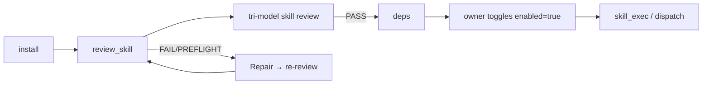

# Creating Skills for Ouroboros

This is the practical guide for **writing your own skills** that
Ouroboros can install, review, enable, and execute. It is the
single place where the manifest schema, the `PluginAPI`, the review
checklist, the lifecycle (install → review → enable → execute), the
widget render schemas, and the marketplace publishing flows are
explained together.

If you are looking for the *runtime* architecture (how the loader
imports plugins, how the tri-model review pipeline is wired, etc.),
read [`docs/ARCHITECTURE.md`](ARCHITECTURE.md). If you want to know
exactly what a reviewer model is asked to check, read the "Skill
Review Checklist" section of [`docs/CHECKLISTS.md`](CHECKLISTS.md).

## What is a skill?

A **skill** is a small package that adds capabilities to Ouroboros:
new tools the agent can call, HTTP routes the desktop app can fetch,
WebSocket message handlers, and host-rendered widget UIs. Skills are
**reviewed** before they can run. Skills dropped in from disk or
marketplaces go through tri-model review and explicit owner lifecycle
actions. Skills authored by the current Ouroboros agent session carry
both payload-local `.self_authored.json` and owner-state
`data/state/skills/<name>/self_authored.json` markers for provenance,
but they still go through the same tri-model skill review before they
can run.

There are three skill types:

| Type | What it ships | When to use |
|------|---------------|-------------|
| `instruction` | Markdown-only `SKILL.md` (no code). | Pure prompts / playbooks for the agent. |
| `script` | One or more scripts under `scripts/` plus a manifest. | Heavy / batch work that runs as a subprocess. |
| `extension` | A `plugin.py` that registers tools/routes/widgets via `PluginAPI`. | Long-lived in-process capabilities, including widgets and chat-driven tools. |

The **runtime ownership** of an installed skill is also tagged:

- `native`: bundled with the launcher (e.g. `weather`).
- `self_authored`: created by Ouroboros itself in the current data
  plane; marked by `.self_authored.json` and reviewed through the
  standard tri-model skill-review path.
- `external`: dropped into `data/skills/external/` by the user.
- `clawhub`: installed via the ClawHub marketplace.
- `ouroboroshub`: installed via the official OuroborosHub catalog.

User-authored or manually copied skills belong under
`data/skills/external/<name>/`. The `native` bucket is reserved for
launcher-seeded skills that carry a `.seed-origin` marker. If a user
payload is accidentally left under `native/`, Ouroboros no longer migrates it
automatically; move it to `external/` or reinstall it so the Repair workflow can
edit and re-review it. Generic file tools also refuse new writes under unseeded
`native/` payloads and tell the agent to use `external/` instead.

## Manifest schema (`SKILL.md` frontmatter or `skill.json`)

A manifest is YAML frontmatter inside `SKILL.md`, OR a standalone
`skill.json`. Both shapes parse to the same dataclass. Use whichever
fits your editing workflow.

```yaml
---
name: weather                       # required, alnum/underscore/dash, ≤64 chars
description: Live weather widget    # required, short summary
version: 0.2.1                      # required, free-form (semver recommended)
type: extension                     # instruction | script | extension
runtime: python3                    # script skills: python/python3/bash/node/deno/ruby/go; extension entry modules are Python plugin.py
entry: plugin.py                    # type=extension only — relative to skill dir
scripts:                            # type=script only
  - name: fetch.py                  # name resolves under scripts/ unless slashes/extensions
    description: Fetch and render
permissions: [net, tool, route, widget, read_settings]   # see "Permissions"
env_from_settings: [OPENROUTER_API_KEY]                  # core keys require an owner grant
when_to_use: User asks for the weather forecast.
timeout_sec: 60                     # default 60, hard cap 300
ui_tab:                             # extension widgets (optional)
  tab_id: live
  title: Weather
  icon: cloud
  render:
    kind: declarative
    schema_version: 1
    components:
      - type: form
        route: search
        method: POST
        target: result
        fields:
          - name: city
            label: City
            type: text
        submit_label: Refresh
      - type: kv
        target: result
        fields:
          - label: Temperature
            path: temp_c
---

# Weather

Markdown body explaining the skill to the user / reviewer / agent.
Everything below the closing `---` becomes `manifest.body`.
```

`runtime` is optional for `type: instruction` (instruction skills never
execute), and required for `script` / `extension`. Allowed values are
`python`, `python3`, `bash`, `node`, plus the v5.7.0 additions
`deno`, `ruby`, `go`. The actual binary is resolved through
`shutil.which` at exec time, so the operator's host must ship the
runtime; otherwise `skill_exec` fails closed with a clear error.

## Lifecycle: install → review → enable → execute



- **Install** lands the payload under the appropriate bucket
  (`data/skills/<bucket>/<name>/`). Marketplace installs also write
  a provenance sidecar (`.clawhub.json` / `.ouroboroshub.json`).
- **Review** runs three reviewer models in parallel against the
  Skill Review Checklist (see [`docs/CHECKLISTS.md`](CHECKLISTS.md)).
  The review pack hashes every runtime-reachable file in the skill
  directory; any later edit invalidates the executable verdict. `.self_authored.json`
  is provenance only; self-authored skills use the same tri-model review,
  grant, enable, and extension reload flow as other executable skills.
- **Isolated deps** (pip / npm / uv / node) install into
  `data/skills/<bucket>/<name>/.ouroboros_env/`. Status is recorded
  in `data/state/skills/<name>/deps.json`.
- **Enable** flips `enabled.json` after a fresh executable review + grants + deps. The
  Skills UI surfaces a toggle; agents can also call `toggle_skill`.
  Self-authored provenance does not change the enablement path.
- **Execute**: `skill_exec` runs `type: script` skills as
  subprocess; `type: extension` runs in-process via the loader.

## Data layout for stateful skills

Stateful skills should keep every user-visible job/session isolated under a
per-job directory. For extensions, prefer:

```python
job_dir = api.skill_job_dir(job_id)
assets_dir = job_dir / "assets"
output_dir = job_dir / "output"
tmp_dir = job_dir / "tmp"
```

This creates `data/state/skills/<skill>/jobs/<sanitized_id>-<hash>/{assets,output,tmp}`.
Use it for generated images, audio, video frames, intermediate artifacts, and
per-request temp files. Keep shared learned data such as prompt lessons or
small caches at the skill state root only when it is intentionally shared across
jobs.

Avoid flat content-keyed filenames such as `assets/keyframe_0.png`,
`concat.txt`, or `_vframe_0.png` directly under `state_dir`; a later or
parallel job can overwrite them. Retry outputs should include an attempt number
or short random suffix, and temporary verification files should live under
`tmp/` and be cleaned when the job finishes.

### Declaring dependencies

Skills may declare auto-installable dependencies in frontmatter:

```yaml
dependencies: [ddgs]
```

or with explicit install specs:

```yaml
install:
  - kind: pip
    package: ddgs
```

Bare `dependencies` entries are treated as Python packages. `pip`,
`pipx`, `uv`, `npm`, and `node` specs are installed only after a fresh
executable review and only under the skill's `.ouroboros_env` directory.
Global package-manager or arbitrary-download specs remain manual setup
guidance.

## The `skill_preflight` tool

When you are writing a skill (or repairing one in heal mode),
`skill_preflight` runs cheap, offline syntax validators on the
payload — in-process Python `compile()` for `.py` files (no
`__pycache__` writes), `node --check` for `.js`/`.mjs`/`.cjs`,
`bash -n` for `.sh`/`.bash`, plus a manifest parse, explicit
entry/script existence checks, and static widget render-schema
validation. It validates manifest `ui_tab.render` and literal
`_UI_RENDER = {...}` declarations in `plugin.py` through the same
runtime validator as `extension_loader`, so typos such as
`action_route` instead of `route` fail before any LLM review or enable
attempt. It does not call any LLM and does not mutate review state, so
the agent can iterate without burning review tokens.

```text
skill_preflight(skill="weather")
skill_preflight(skill="weather", paths=["plugin.py"])
```

## Repair task path scheme and edit tools

Skills repaired from the Skills or Marketplace UI run under a structured
`task_constraint.mode="skill_repair"`. The constraint identifies the selected
skill and payload root, so repair tools use payload-relative paths:

| Tool | Repair path example | Use when |
|------|---------------------|----------|
| `data_read` / `data_list` | `plugin.py`, `scripts/main.py` | Inspect payload files. |
| `str_replace_editor` | `plugin.py` | One exact replacement in an existing file. |
| `claude_code_edit` | `cwd="."` or omitted | Coordinated multi-hunk edits; cwd is forced to the payload root. |
| `data_write` | `new_module.py` | New files or intentional full-file rewrites. |
| `skill_preflight` | `skill="weather"` | Cheap read-only syntax/schema check before LLM review. |
| `review_skill` | `skill="weather"` | Required final tri-model review. |

Repair mode blocks shell, browser/search, scheduling, skill execution,
repo commits, extension tools, key grants, and enable/disable flows. Finish
with `skill_preflight` and `review_skill`; the owner enables or grants access
after a fresh executable review.

### Light-mode short-form authoring (no repair constraint)

Under `runtime_mode=light` without a `skill_repair` task constraint, the
same three edit tools (`data_write`, `str_replace_editor`, `claude_code_edit`)
accept two optional args — `bucket` (one of `external` / `clawhub` /
`ouroboroshub`; `native` is excluded) and `skill_name`. When both are
supplied, a short relative `path` / `cwd` (e.g. `plugin.py`, `lib/utils.py`,
or `.`) resolves under `data/skills/<bucket>/<skill_name>/`, the same payload
root the repair flow would pick. Supply both args together — passing only
one returns a clear `bucket and skill_name must be supplied together` error
instead of silently writing into the drive root.

Equivalent ways to address `data/skills/external/weather/plugin.py` under
light:

```text
data_write(path="data/skills/external/weather/plugin.py", content=...)
data_write(path="plugin.py", content=..., bucket="external", skill_name="weather")
```

Control-plane sidecars (`.clawhub.json`, `.ouroboroshub.json`,
`.self_authored.json`, `.seed-origin`, `SKILL.openclaw.md`) stay blocked
either way — the bucket+skill_name short form does not weaken sidecar
protection.

### Writing large payload files

The hard ceiling for any single tool call is the LLM output token budget —
about a few thousand lines of code, depending on the model and prompt
overhead. Two reliable strategies when a generated payload exceeds that
ceiling:

1. **`data_write(mode="append")` in chunks.** Each call appends the next
   slice; the file lands intact across multiple turns. Useful for
   structured assets (CSV, JSONL, prose corpora) the agent itself is
   generating.
2. **`claude_code_edit`.** The Agent SDK gateway subdivides large writes
   into many small `Write` / `Edit` operations inside its own loop, so a
   single call can produce a payload that no single `data_write` could
   fit. Pair with `validate=True` to run smoke tests in the same call.

`run_shell` heredoc is **not** a workaround — every byte of a heredoc body
still passes through the same LLM output budget, so it offers no real
bypass and is harder to review.

## Permissions

The manifest's `permissions` list authorises specific PluginAPI
calls and runtime behaviours:

| Permission | What it grants |
|------------|----------------|
| `net` | The skill may make outbound network calls. |
| `fs` | The skill may write outside its state dir (review item still enforces confinement). |
| `subprocess` | The skill may spawn child processes (review items + cwd-confinement still enforce). |
| `widget` | The skill may call `register_ui_tab` and `register_settings_section`. |
| `ws_handler` | The skill may call `register_ws_handler` and `send_ws_message`. |
| `route` | The skill may call `register_route`. |
| `tool` | The skill may call `register_tool`. |
| `read_settings` | The skill may call `api.get_settings([...])`. |
| `supervised_task` | The skill may register an in-process host-supervised async task. |
| `companion_process` | The skill may register a manifest-declared companion subprocess supervised by the host. |
| `subscribe_event` | The skill may subscribe to manifest-declared host event topics such as `chat.outbound` or `skill.lifecycle`. Chat topics require owner permission grants; `skill.lifecycle` does not. |
| `inject_chat` | The skill may request Host Service chat injection after an explicit owner permission grant. |

A missing permission causes the matching `register_*` call to raise
`ExtensionRegistrationError`, surfaced as a skill load error in the
Skills UI.

## Grants for protected keys and host permissions

Some settings keys are protected: `OPENROUTER_API_KEY`,
`OPENAI_API_KEY`, `OPENAI_COMPATIBLE_API_KEY`, `ANTHROPIC_API_KEY`,
`CLOUDRU_FOUNDATION_MODELS_API_KEY`, `TELEGRAM_BOT_TOKEN`,
`GITHUB_TOKEN`, `OUROBOROS_NETWORK_PASSWORD`. These keys are NEVER
forwarded to a skill by default, even when listed in
`env_from_settings`. Custom secret keys stored in Settings → Secrets
are treated the same way. Host permissions such as `inject_chat` and
chat event subscriptions also require explicit, content-hash-bound owner
consent. The desktop launcher's owner-grant bridge records these grants.

The Skills UI surfaces missing grants on the skill card. The agent
can also call `toggle_skill enabled=true` only after grants are
approved (the tool returns `SKILL_TOGGLE_ERROR: cannot enable until
requested key and permission grants are approved`). Self-authored markers are
provenance only; they do not auto-grant keys or auto-enable skills.

Owners can enable `OUROBOROS_AUTO_GRANT_REVIEWED_SKILLS` in Settings →
Behavior → Skills; desktop asks for native confirmation and web uses the owner
endpoint. When enabled, a fresh executable review grants only the
manifest-declared keys and host permissions for the current content hash. Under
blocking enforcement, blocker reviews are not executable and do not auto-grant;
under advisory enforcement, blocker findings may auto-grant only because that
mode makes the review executable. Editing the skill still invalidates those
grants.

## Notifying the owner when work completes

Long-running or user-visible skills should make completion and failure visible.
For `type: script` skills, `skill_exec` appends `skill_exec_finished` or
`skill_exec_failed` records to `logs/events.jsonl` and publishes them on the
`skill.lifecycle` event topic with `skill`, `script`, `exit_code`, and `error`
fields where relevant. Extension skills may declare:

```yaml
permissions: [subscribe_event]
subscribe_events: [skill.lifecycle]
```

`skill.lifecycle` is not a chat-content topic, so it does not require an owner
permission grant. Skills that perform multi-step external work should still
print a concise success/failure marker or write structured state under
`OUROBOROS_SKILL_STATE_DIR` so the agent can decide whether to fix or report.

## Iterative skill development

The recommended closed-loop workflow is:

1. Edit the skill payload under `data/skills/external/<name>/`,
   `data/skills/clawhub/<name>/`, or `data/skills/ouroboroshub/<name>/`.
2. Run `skill_preflight(skill="<name>")` for cheap syntax/manifest checks.
3. Run `review_skill(skill="<name>")` and address every critical finding.
4. If `OUROBOROS_REVIEW_ENFORCEMENT=advisory`, inspect each advisory finding
   and either fix it or record why it is accepted for now.
5. Enable the skill, grant required keys/permissions (or use the auto-grant
   setting for reviewed closed-loop development), then run `skill_exec`.
6. Read stdout/stderr and `skill_exec_finished` / `skill_exec_failed` events,
   fix the payload, and repeat until the skill works.

## PluginAPI reference

The frozen ABI is documented in
[`ouroboros/contracts/plugin_api.py`](../ouroboros/contracts/plugin_api.py).
This section shows the practical shape.

```python
def register(api):
    # Tools — agent-callable, namespaced as ext_<len>_<token>_<name>.
    api.register_tool(
        "search",
        handler=do_search,
        description="Web search",
        schema={
            "type": "object",
            "properties": {"query": {"type": "string"}},
            "required": ["query"],
        },
        timeout_sec=60,
    )

    # HTTP routes — mounted at /api/extensions/<skill>/<path>.
    api.register_route("search", handler=http_search, methods=("POST",))

    # WebSocket message handlers (inbound) and broadcasts (outbound).
    api.register_ws_handler("ping", handler=ws_ping)
    api.send_ws_message("event", {"hello": "world"})

    # Widget UI tab on the Widgets page.
    api.register_ui_tab(
        "live",
        title="Search",
        render={
            "kind": "declarative",
            "schema_version": 1,
            "components": [...],
        },
    )

    # Settings sub-section on the Settings page (v5.7.0+).
    # Settings sections use a narrow declarative subset: form/action for
    # configuration writes and markdown/json for explanatory diagnostics.
    # Rich widget-only components (media, stream, map, kanban, module JS)
    # belong on the Widgets page, not Settings.
    api.register_settings_section(
        "config",
        title="Search settings",
        schema={"components": [
            {"type": "form", "route": "config/save", "method": "POST", "fields": [...]},
        ]},
    )

    # Cleanup callback when the extension is unloaded / disabled.
    api.on_unload(close_pool)

    # Read-only runtime info (v5.7.0+).
    info = api.get_runtime_info()
    # {runtime_mode, app_version, data_dir, server_port, skill_dir, state_dir}

    # Read settings keys allow-listed in env_from_settings.
    keys = api.get_settings(["OPENROUTER_API_KEY"])
```

### Async tool handlers (v5.7.0+)

Tool handlers can be plain functions OR `async def` coroutines —
the registry detects coroutines and runs them on a helper thread with
a fresh event loop under `asyncio.wait_for(timeout_sec)`. They do not
execute on the server's main event loop, so do not rely on loop-local
state captured at registration time. HTTP routes and WS handlers have
always supported async; v5.7.0 closes the asymmetry for tools.

```python
async def do_search(ctx, query: str = ""):
    async with httpx.AsyncClient() as client:
        resp = await client.get(...)
    return resp.text

api.register_tool("search", handler=do_search, description=..., schema=...)
```

### `kind: "module"` widgets (v5.7.0+)

For surfaces the declarative components cannot express, ship a `widget.js`
mounted inside a sandboxed `<iframe srcdoc>`:

```yaml
ui_tab:
  tab_id: editor
  title: Editor
  render:
    kind: module
    entry: widget.js
```

The host fetches reviewed JS through `GET /api/extensions/<skill>/module/<entry>`,
embeds it in an opaque-origin iframe (`sandbox="allow-scripts"`, no
`allow-same-origin`), and injects a fetch bridge that forwards only
`/api/extensions/<skill>/...` paths. The `widget_module_safety` review item still
checks the source; do not rely on the sandbox alone.

For everything else, prefer declarative components (`form`, `action`, `poll`,
`subscription`, `stream`, `table`, `chart`, `markdown`, `json`, `kv`, `status`,
`tabs`, `progress`, media/file/gallery, map/calendar/kanban). They handle XSS,
CSRF, and lifecycle automatically. `subscription.render` may contain passive
display children only; never nest interactive components there.

### Widget composition rules

The host validates widget render schemas before load. A top-level `tabs`
component may group passive display components, but each
`tabs[].components[]` list must not contain interactive or nested lifecycle
components:

| Parent component | Forbidden child component types |
|------------------|---------------------------------|
| `tabs` → `tabs[].components[]` | `form`, `action`, `poll`, `subscription`, `stream`, `tabs` |

Put interactive forms/actions/polls at the top level, or split the workflow
across separate tabs/widgets. This mirrors the runtime validator in
`extension_loader._validate_ui_render` and avoids nested remount/polling states
the host renderer does not own.

### Async job error contract

Long-running widget actions follow the declarative async job contract: start
route returns `job_id`; status route returns `queued`, `running`, `done`, or
`error`; the host resumes polling by `job_id` after tab switches. If you use
`asyncio.gather(..., return_exceptions=True)`, convert exceptions into an
explicit job failure instead of only logging them:

```python
results = await asyncio.gather(*tasks, return_exceptions=True)
errors = [item for item in results if isinstance(item, Exception)]
if errors:
    job["status"] = "error"
    job["error"] = "; ".join(str(error) for error in errors[:3])
else:
    job["status"] = "done"
```

## Skill Review Checklist

Reviewers grade your skill on the checklist defined in
[`docs/CHECKLISTS.md`](CHECKLISTS.md) §"Skill Review Checklist". That file is
the authoritative SSOT — read it there once and consult it whenever you author
or repair a skill instead of reading a paraphrase here. Review verdicts are
`clean`, `warnings`, `blockers`, or `pending`; execution is decided by
`review_gate.executable_review`.

## Reference skills

The simplest reference for each type lives in `repo/skills/` and
the OuroborosHub catalog:

- `weather` — `type: extension`, declarative form/key-value widget,
  reads no env keys.
- `duckduckgo` — `type: extension`, declarative form widget, no
  env keys, declares the `ddgs` Python package as an isolated dependency.
- `perplexity` — `type: extension`, declarative form widget,
  `read_settings` for `OPENROUTER_API_KEY`.

You can read their full source under
`data/skills/native/<name>/` for launcher-seeded examples, under
`data/skills/external/<name>/` for your own local skills, or by browsing
`joi-lab/OuroborosHub` on GitHub.

## Publishing

### OuroborosHub (official, curated)

`joi-lab/OuroborosHub` is the official catalog Ouroboros installs
from. The normal publishing path is agent-driven:

1. Finish the local skill under `data/skills/<bucket>/<slug>/`.
2. Run `skill_preflight` and `review_skill`; submission requires a
   fresh `clean` review whose stored `content_hash` matches the current
   payload.
3. Configure `GITHUB_TOKEN` in Settings → Secrets.
4. Use the Skills card menu → **Submit to OuroborosHub**, or ask in
   chat: `Submit skill <slug> to OuroborosHub`.

The agent calls `submit_skill_to_hub`, infers the upstream destination
from `OUROBOROS_HUB_CATALOG_URL`, creates or reuses the user's GitHub
fork, commits `skills/<slug>/...` plus an updated `catalog.json` on a
`submit/<slug>-v<version>` branch, and opens a PR. If the same version
already exists in the catalog, bump the skill version and re-review
before submitting again.

### ClawHub (third-party, registry-driven)

ClawHub is the broader OpenClaw registry. Publishing requires an
OpenClaw publisher account; once your skill is on the registry the
ClawHub tab in the Marketplace will install it via the
`adapt_openclaw_skill` translation pipeline. Note that the adapter
preserves the original `SKILL.openclaw.md` next to the translated
`SKILL.md` so reviewers can cross-check both manifests.

## Migration patterns

When you bump the schema your `state_dir/` files use, run the
migration in your `register(api)` (idempotent, fast). Example:

```python
def register(api):
    state = pathlib.Path(api.get_state_dir())
    legacy = state / "legacy_db.json"
    modern = state / "db_v2.json"
    if legacy.exists() and not modern.exists():
        modern.write_text(_migrate(legacy.read_text(encoding="utf-8")), encoding="utf-8")
        legacy.unlink()
    # ... continue registration
```

## Troubleshooting

| Symptom | Likely cause |
|---------|--------------|
| `SKILL_EXEC_BLOCKED: review status is 'pending'` | Run `review_skill` for this skill. |
| `SKILL_TOGGLE_ERROR: dependency fingerprint is stale` | Re-run `review_skill`; post-review deps reconciliation will reinstall. |
| `EXTENSION_NOT_LIVE` on tool dispatch | The skill is disabled or the loader had a load_error — check the Skills UI. |
| `HEAL_MODE_BLOCKED: ...` | The Repair task tried to call a tool the internal heal-mode allowlist does not permit; finish the Repair flow with `review_skill` and exit. |
| `PluginAPI.register_*` raises `ExtensionRegistrationError` | The skill is missing the matching permission in its manifest. |
| Reviewer marks `widget_module_safety: FAIL` | `widget.js` is touching `document.cookie` / `localStorage` / cross-origin `fetch`. Move the data through `/api/extensions/<skill>/` routes. |

For deeper integration questions read
[`docs/ARCHITECTURE.md`](ARCHITECTURE.md) §13 (external skills layer)
and [`docs/CHECKLISTS.md`](CHECKLISTS.md) §"Skill Review Checklist".
